# 介面流程圖（根據實際前端架構重新設計）

> 本文檔根據實際前端程式碼架構重新設計，確保所有流程圖與實際實作一致。
> 最後更新：2024年（基於 App.tsx、Dashboard、Account、ClubManagement 等實際檔案）

---

## 1. 系統整體架構

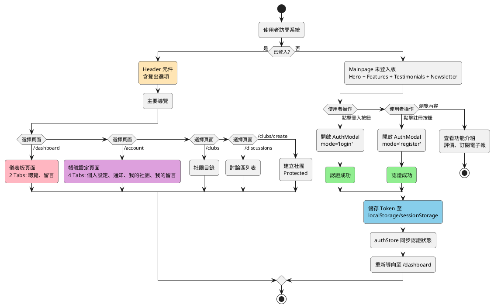

### 關鍵說明
- **認證檢查**：`useAuthStore` 的 `isAuthenticated` 狀態決定顯示內容
- **初始化流程**：App.tsx 啟動時執行 `initialize()` 從 storage 恢復登入狀態
- **跨分頁同步**：監聽 `storage` 事件，當 `access_token` 變更時觸發 `syncFromStorage()`
- **Protected Route**：未登入使用者訪問受保護路由會被重新導向至 `/`

---

## 2. 使用者認證流程（登入/註冊）

### 2.1 登入流程

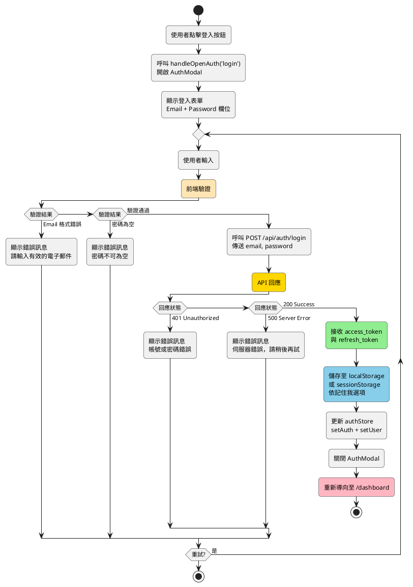

### 2.2 註冊流程

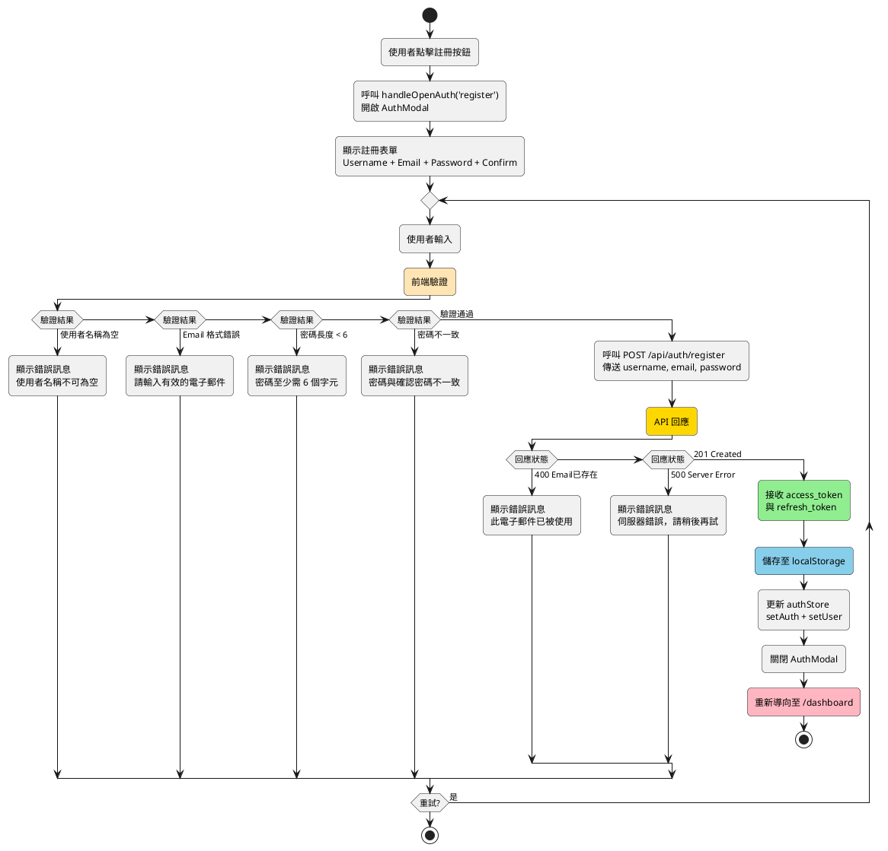

### 關鍵說明
- **認證模態框**：`AuthModal` 元件接收 `mode` prop（'login' 或 'register'）
- **狀態管理**：使用 `authStore` (Zustand) 管理認證狀態
- **Token 儲存**：根據「記住我」選項決定使用 localStorage 或 sessionStorage
- **自動登入**：App.tsx 初始化時從 storage 恢復 token

---

## 3. 主頁面流程(未登入版)

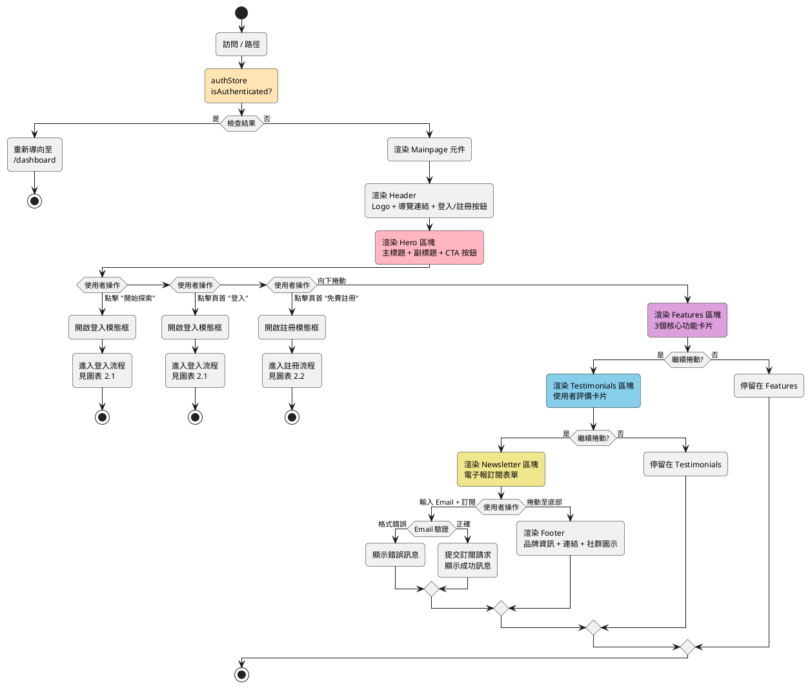

### 關鍵說明
- **條件渲染**：根據 `isAuthenticated` 決定顯示行銷頁面或重新導向
- **Hero 區塊**：主要 CTA（Call-to-Action）引導使用者登入或註冊
- **Features 區塊**：展示核心功能（6個功能卡片）
- **Testimonials 區塊**：使用者評價與推薦
- **Newsletter 區塊**：電子報訂閱功能
- **Footer 區塊**：包含產品、支援、社群連結

---

## 4. 儀表板流程（Dashboard）

> **實際結構**：Dashboard 僅有 **2 個 Tab**，不是 4 個

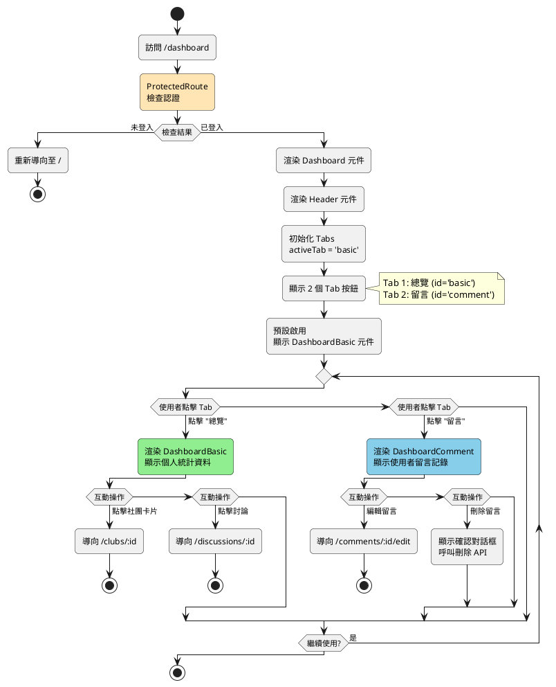

### 實際 Tab 結構（來自 Dashboard/index.tsx）
```typescript
const tabs = [
  { id: 'basic' as const, label: '總覽' },      // DashboardBasic 元件
  { id: 'comment' as const, label: '留言' },    // DashboardComment 元件
];
```

### 關鍵說明
- **Tab 數量**：實際僅有 **2 個 Tab**（總覽、留言）
- **預設 Tab**：`activeTab` 初始值為 `'basic'`
- **元件對應**：
  - `basic` → `DashboardBasic.tsx`
  - `comment` → `DashboardComment.tsx`

---

## 5. 社團相關流程

### 5.1 探索社團（Club Directory）

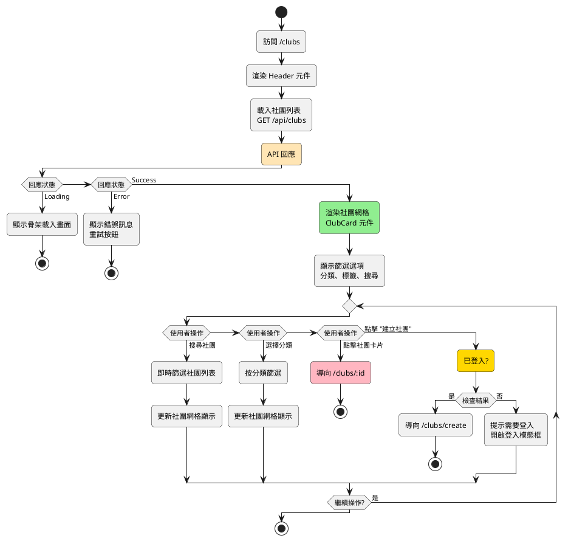

### 5.2 社團詳情頁（Club Detail）

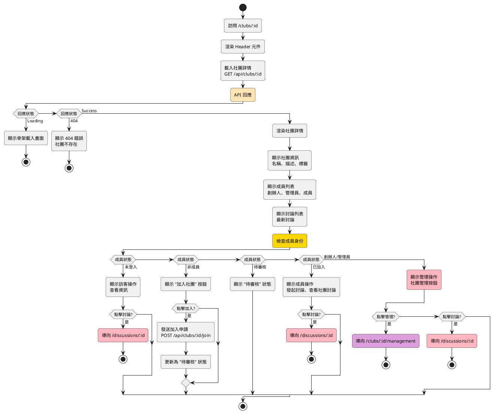

### 5.3 建立社團（Club Create）

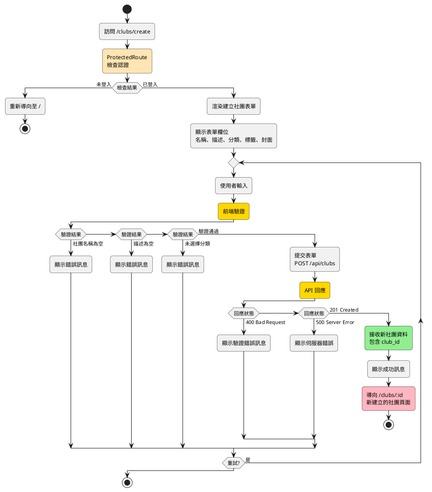

---

## 6. 討論區流程

### 6.1 討論列表（Discussions）

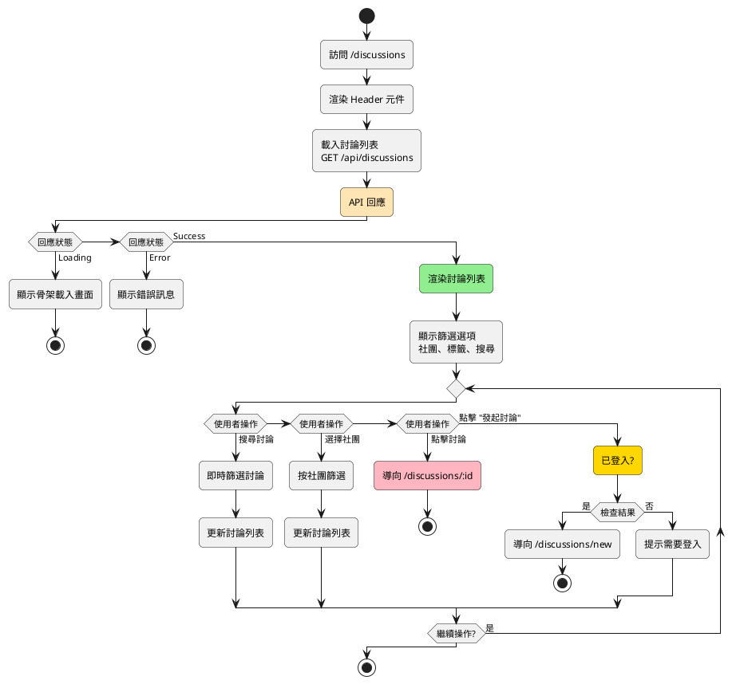

### 6.2 討論詳情（Discussion Detail）

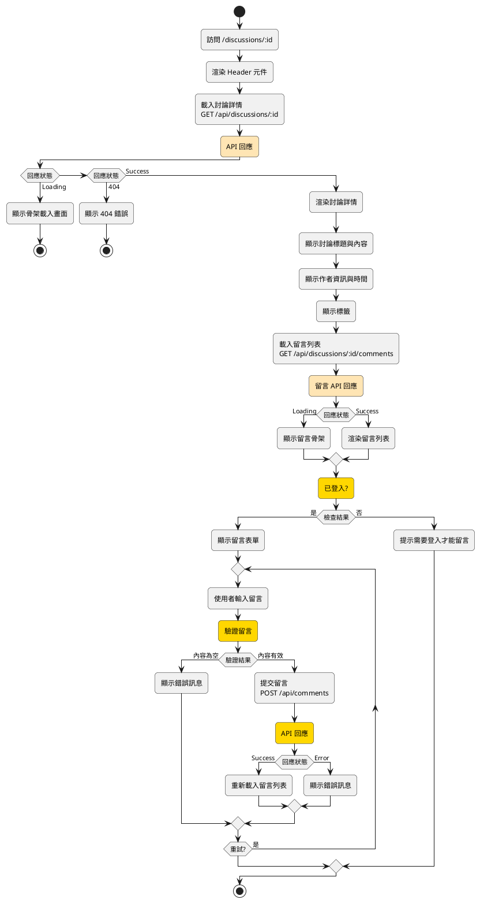

### 6.3 發起討論（Discussion New）

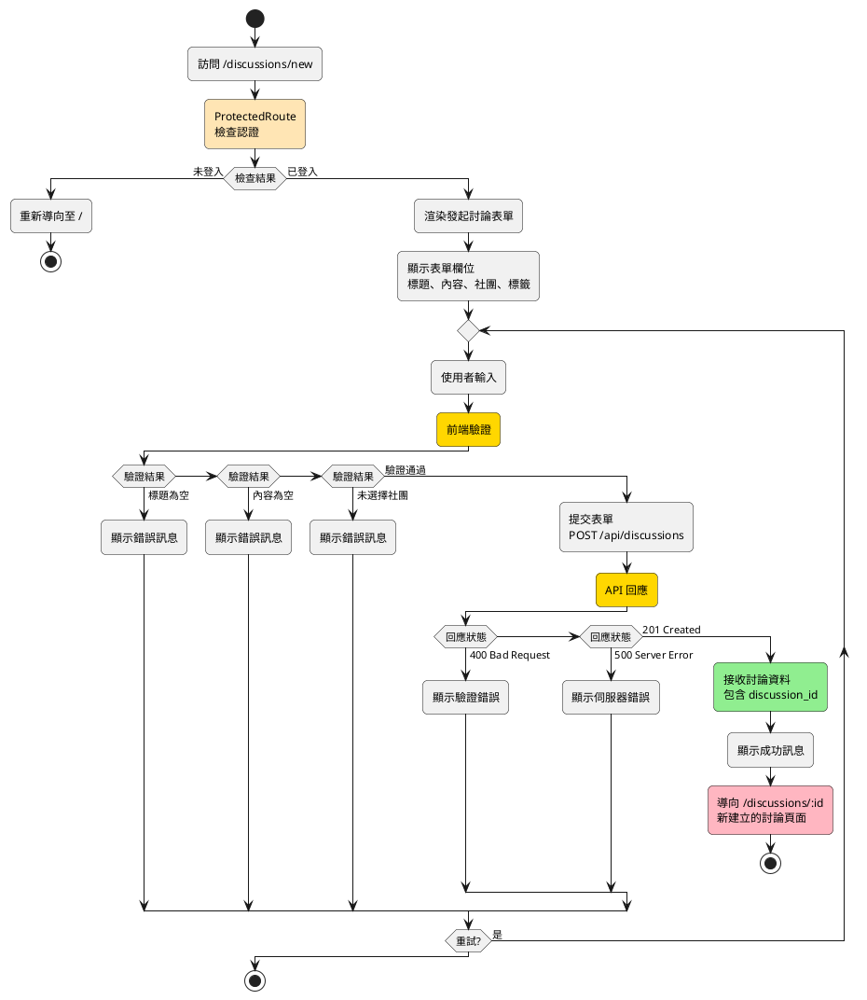
    style ClientValidate fill:#FFD700
    style APIResponse fill:#FFD700
    style ReceiveData fill:#90EE90
```

---

## 7. 個人帳戶流程（Account）

> **實際結構**：Account 有 **4 個 Tab**（不是 6 個）

```mermaid
graph TB
    Start([訪問 /account]) --> CheckAuth{ProtectedRoute<br/>檢查認證}
    
    CheckAuth -->|未登入| RedirectHome[重新導向至 /]
    CheckAuth -->|已登入| RenderAccount[渲染 Account 元件]
    
    RenderAccount --> RenderHeader[渲染 Header 元件]
    RenderHeader --> CheckURLParam{檢查 URL 參數<br/>?tab=xxx}
    
    CheckURLParam -->|有 tab 參數| SetActiveTab[設定 activeTab<br/>根據參數值]
    CheckURLParam -->|無參數| DefaultTab[預設 activeTab='setting']
    
    SetActiveTab --> RenderSidebar[渲染左側導覽欄]
    DefaultTab --> RenderSidebar
    
    RenderSidebar --> ShowTabs[顯示 4 個 Tab 按鈕]
    
    ShowTabs --> Tab1[Tab 1: 個人設定<br/>id='setting']
    ShowTabs --> Tab2[Tab 2: 通知<br/>id='notify']
    ShowTabs --> Tab3[Tab 3: 我的社團<br/>id='club']
    ShowTabs --> Tab4[Tab 4: 我的留言<br/>id='comment']
    
    Tab1 --> DefaultActive[預設啟用<br/>Setting 元件]
    
    DefaultActive --> UserClickTab{使用者點擊 Tab}
    
    UserClickTab -->|點擊 "個人設定"| ShowSetting[渲染 Setting 元件<br/>編輯個人資料表單]
    UserClickTab -->|點擊 "通知"| ShowNotify[渲染 Notify 元件<br/>顯示通知列表]
    UserClickTab -->|點擊 "我的社團"| ShowClub[渲染 Club 元件<br/>顯示已加入社團列表]
    UserClickTab -->|點擊 "我的留言"| ShowComment[渲染 Comment 元件<br/>顯示留言記錄]
    
    ShowSetting --> SettingAction{互動操作}
    SettingAction -->|編輯個人資料| UpdateProfile[呼叫 PATCH /api/users/profile<br/>更新個人資料]
    SettingAction -->|上傳頭像| UploadAvatar[呼叫 POST /api/users/avatar<br/>上傳圖片]
    
    ShowClub --> ClubAction{互動操作}
    ClubAction -->|點擊社團卡片| NavigateClubDetail[導向 /clubs/:id]
    ClubAction -->|點擊 "管理社團"| NavigateManagement[導向 /clubs/:id/management<br/>限創辦人/管理員]
    
    ShowComment --> CommentAction{互動操作}
    CommentAction -->|編輯留言| NavigateEditComment[導向 /comments/:id/edit]
    CommentAction -->|刪除留言| ConfirmDelete[顯示確認對話框<br/>呼叫刪除 API]
    
    style CheckAuth fill:#FFE5B4
    style Tab1 fill:#FFB6C1
    style Tab2 fill:#DDA0DD
    style Tab3 fill:#87CEEB
    style Tab4 fill:#F0E68C
    style ShowSetting fill:#90EE90
```

### 實際 Tab 結構（來自 Account/index.tsx）
```typescript
const tabs = [
  { id: 'setting' as const, label: '個人設定', icon: '...' },   // Setting.tsx
  { id: 'notify' as const, label: '通知', icon: '...' },       // Notify.tsx
  { id: 'club' as const, label: '我的社團', icon: '...' },      // Club.tsx
  { id: 'comment' as const, label: '我的留言', icon: '...' },   // Comment.tsx
];
```

### 關鍵說明
- **Tab 數量**：實際僅有 **4 個 Tab**
- **URL 參數支援**：支援 `?tab=club` 等參數直接定位到特定 Tab
- **預設 Tab**：`activeTab` 初始值為 `'setting'`
- **元件對應**：
  - `setting` → `Setting.tsx`
  - `notify` → `Notify.tsx`
  - `club` → `Club.tsx`
  - `comment` → `Comment.tsx`

---

## 8. 社團管理流程（Club Management）

> **實際結構**：管理頁面有 **3 或 4 個 Tab**（取決於使用者角色）

### 8.1 管理頁面架構

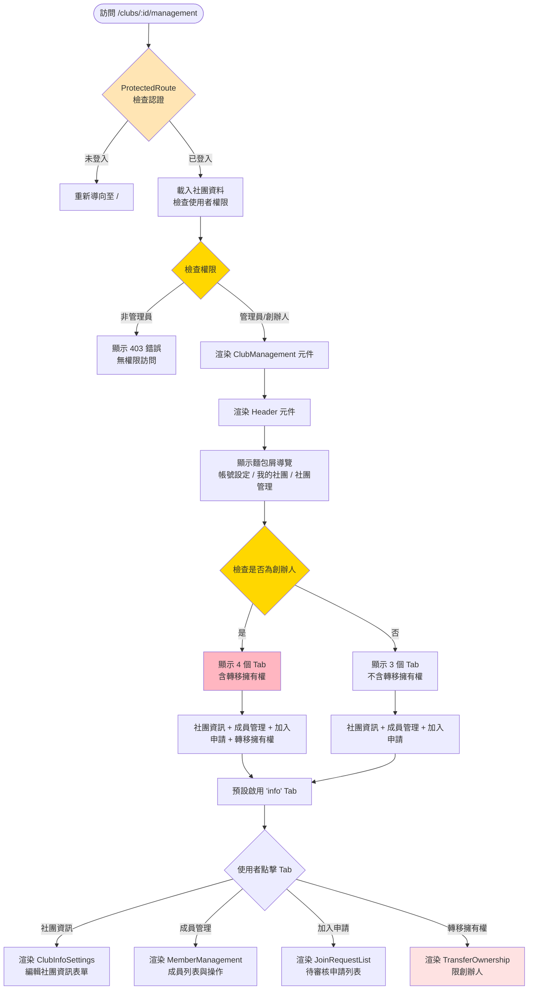

### 實際 Tab 結構（來自 ClubManagement.tsx）
```typescript
// 基本標籤（所有管理者都能看到）
const baseTabs = [
  { id: 'info' as TabType, name: '社團資訊', icon: '...' },      // ClubInfoSettings
  { id: 'members' as TabType, name: '成員管理', icon: '...' },    // MemberManagement
  { id: 'requests' as TabType, name: '加入申請', icon: '...' },   // JoinRequestList
];

// 只有創辦人才能看到的標籤
const ownerOnlyTab = { 
  id: 'transfer' as TabType, 
  name: '轉移擁有權', 
  icon: '...' 
};

// 根據用戶角色組合標籤
const tabs = isOwner ? [...baseTabs, ownerOnlyTab] : baseTabs;
```

### 8.2 社團資訊 Tab（ClubInfoSettings）

```mermaid
graph TB
    Start([點擊 "社團資訊" Tab]) --> RenderForm[渲染社團資訊表單]
    
    RenderForm --> ShowFields[顯示表單欄位<br/>名稱、描述、分類、標籤、封面]
    
    ShowFields --> LoadCurrentData[載入當前社團資料<br/>預填表單]
    
    LoadCurrentData --> UserAction{使用者操作}
    
    UserAction -->|編輯欄位| EnableSaveButton[啟用儲存按鈕]
    UserAction -->|上傳封面| UploadImage[上傳圖片至伺服器<br/>預覽圖片]
    UserAction -->|點擊儲存| ValidateForm{前端驗證}
    
    ValidateForm -->|名稱為空| ShowNameError[顯示錯誤訊息]
    ValidateForm -->|描述為空| ShowDescError[顯示錯誤訊息]
    ValidateForm -->|驗證通過| SubmitUpdate[提交更新<br/>PATCH /api/clubs/:id]
    
    ShowNameError --> UserAction
    ShowDescError --> UserAction
    
    SubmitUpdate --> APIResponse{API 回應}
    
    APIResponse -->|400| ShowValidationError[顯示驗證錯誤]
    APIResponse -->|500| ShowServerError[顯示伺服器錯誤]
    APIResponse -->|200| ShowSuccess[顯示成功訊息<br/>更新本地資料]
    
    ShowValidationError --> UserAction
    ShowServerError --> UserAction
    
    style ValidateForm fill:#FFD700
    style APIResponse fill:#FFE5B4
    style ShowSuccess fill:#90EE90
```

### 8.3 成員管理 Tab（MemberManagement）

```mermaid
graph TB
    Start([點擊 "成員管理" Tab]) --> LoadMembers[載入成員列表<br/>GET /api/clubs/:id/members]
    
    LoadMembers --> APIResponse{API 回應}
    
    APIResponse -->|Loading| ShowSkeleton[顯示骨架載入畫面]
    APIResponse -->|Success| RenderMemberList[渲染成員列表]
    
    RenderMemberList --> ShowRoles[顯示成員角色<br/>創辦人、管理員、成員]
    
    ShowRoles --> CheckUserRole{檢查當前使用者角色}
    
    CheckUserRole -->|創辦人| ShowOwnerActions[顯示完整操作選單]
    CheckUserRole -->|管理員| ShowAdminActions[顯示受限操作選單]
    
    ShowOwnerActions --> OwnerUserAction{使用者操作}
    ShowAdminActions --> AdminUserAction{使用者操作}
    
    OwnerUserAction -->|搜尋成員| FilterMembers[即時篩選成員列表]
    OwnerUserAction -->|點擊成員| ShowOwnerMenu[顯示操作選單<br/>設為管理員/移除管理員/移除成員]
    
    AdminUserAction -->|搜尋成員| FilterMembers
    AdminUserAction -->|點擊一般成員| ShowAdminMenu[顯示操作選單<br/>僅移除成員]
    
    ShowOwnerMenu --> OwnerMenuAction{選擇操作}
    
    OwnerMenuAction -->|設為管理員| ConfirmPromote[顯示確認對話框]
    OwnerMenuAction -->|移除管理員| ConfirmDemote[顯示確認對話框]
    OwnerMenuAction -->|移除成員| ConfirmRemove[顯示確認對話框]
    
    ShowAdminMenu --> ConfirmRemove
    
    ConfirmPromote --> CallPromoteAPI[呼叫 POST /api/clubs/:id/members/:userId/promote]
    ConfirmDemote --> CallDemoteAPI[呼叫 POST /api/clubs/:id/members/:userId/demote]
    ConfirmRemove --> CallRemoveAPI[呼叫 DELETE /api/clubs/:id/members/:userId]
    
    CallPromoteAPI --> RefreshList[重新載入成員列表]
    CallDemoteAPI --> RefreshList
    CallRemoveAPI --> RefreshList
    
    style APIResponse fill:#FFE5B4
    style CheckUserRole fill:#FFD700
    style ConfirmPromote fill:#90EE90
    style ConfirmRemove fill:#FEE2E2
```

### 關鍵說明
- **權限區分**：
  - **創辦人**：可設為管理員、移除管理員、移除成員（完整權限）
  - **管理員**：僅可移除一般成員（受限權限,無法操作其他管理員）
- **操作限制**：管理員無法對其他管理員或創辦人進行任何操作
- **確認機制**：所有操作前都會顯示確認對話框

### 8.4 加入申請 Tab（JoinRequestList）

```mermaid
graph TB
    Start([點擊 "加入申請" Tab]) --> LoadRequests[載入申請列表<br/>GET /api/clubs/:id/requests]
    
    LoadRequests --> APIResponse{API 回應}
    
    APIResponse -->|Loading| ShowSkeleton[顯示骨架載入畫面]
    APIResponse -->|Success| RenderRequestList[渲染申請列表]
    
    RenderRequestList --> CheckEmpty{是否有申請?}
    
    CheckEmpty -->|無申請| ShowEmptyState[顯示空狀態<br/>目前沒有待審核申請]
    CheckEmpty -->|有申請| ShowRequests[顯示申請卡片<br/>申請者資訊 + 申請時間]
    
    ShowRequests --> UserAction{使用者操作}
    
    UserAction -->|點擊 "核准"| ConfirmApprove[顯示確認對話框]
    UserAction -->|點擊 "拒絕"| ConfirmReject[顯示確認對話框]
    
    ConfirmApprove --> CallApproveAPI[呼叫 POST /api/clubs/:id/requests/:requestId/approve]
    ConfirmReject --> CallRejectAPI[呼叫 POST /api/clubs/:id/requests/:requestId/reject]
    
    CallApproveAPI --> ApproveResponse{API 回應}
    CallRejectAPI --> RejectResponse{API 回應}
    
    ApproveResponse -->|Success| ShowApproveSuccess[顯示成功訊息<br/>已核准加入]
    RejectResponse -->|Success| ShowRejectSuccess[顯示成功訊息<br/>已拒絕申請]
    
    ShowApproveSuccess --> RefreshList[重新載入申請列表]
    ShowRejectSuccess --> RefreshList
    
    RefreshList --> RenderRequestList
    
    style APIResponse fill:#FFE5B4
    style ConfirmApprove fill:#90EE90
    style ConfirmReject fill:#FEE2E2
```

### 8.5 轉移擁有權 Tab（TransferOwnership）

> **權限限制**：此 Tab **僅創辦人可見**

```mermaid
graph TB
    Start([點擊 "轉移擁有權" Tab<br/>限創辦人]) --> RenderForm[渲染轉移表單<br/>TransferOwnership 元件]
    
    RenderForm --> ShowFields[顯示表單欄位<br/>新擁有者 Username<br/>新擁有者 Email]
    
    ShowFields --> InitialState[表單初始狀態<br/>按鈕 disabled]
    
    InitialState --> UserInput{使用者輸入}
    
    UserInput -->|填寫欄位| ValidateInput{即時驗證}
    
    ValidateInput -->|任一欄位為空| DisableButton[按鈕保持 disabled<br/>顯示錯誤提示]
    ValidateInput -->|兩欄位都有值| EnableButton[啟用轉移按鈕]
    
    DisableButton --> UserInput
    
    EnableButton --> UserClickTransfer{點擊 "轉移擁有權"}
    
    UserClickTransfer -->|是| ShowWarning[顯示警告訊息<br/>⚠️ 此操作無法撤銷]
    
    ShowWarning --> UserConfirm{使用者確認}
    
    UserConfirm -->|取消| ResetForm[保持在表單<br/>不執行操作]
    UserConfirm -->|確認| CallTransferAPI[呼叫 POST /api/clubs/:id/transfer<br/>傳送 username, email]
    
    CallTransferAPI --> APIResponse{API 回應}
    
    APIResponse -->|404 User Not Found| ShowUserNotFoundError[顯示錯誤訊息<br/>找不到該使用者<br/>請確認 Username 和 Email]
    APIResponse -->|400 Invalid Member| ShowInvalidMemberError[顯示錯誤訊息<br/>該使用者不是社團成員]
    APIResponse -->|500 Server Error| ShowServerError[顯示伺服器錯誤]
    APIResponse -->|200 Success| ShowSuccess[顯示成功訊息<br/>擁有權轉移成功]
    
    ShowUserNotFoundError --> UserInput
    ShowInvalidMemberError --> UserInput
    ShowServerError --> UserInput
    
    ShowSuccess --> ClearForm[清空表單欄位]
    ClearForm --> ShowFinalWarning[顯示最終提示<br/>您已不再是創辦人<br/>即將返回社團頁面]
    
    ShowFinalWarning --> RedirectOptions{選擇返回目的地}
    
    RedirectOptions -->|選項 1| NavigateClub[導向 /clubs/:id<br/>社團詳情頁]
    RedirectOptions -->|選項 2| NavigateDashboard[導向 /dashboard<br/>儀表板]
    RedirectOptions -->|選項 3| StayOnPage[留在當前頁面<br/>但轉移 Tab 已消失]
    
    style ValidateInput fill:#FFD700
    style ShowWarning fill:#FEF3C7
    style APIResponse fill:#FFE5B4
    style ShowSuccess fill:#D1FAE5
    style ShowFinalWarning fill:#FEE2E2
```

### 關鍵說明
- **權限檢查**：根據 `isOwner` 動態顯示 3 或 4 個 Tab
- **轉移擁有權限制**：
  - 僅創辦人可見此 Tab
  - 需要輸入新擁有者的 Username 和 Email（雙重驗證）
  - 操作無法撤銷，顯示多重警告
- **成員管理權限**：管理員和創辦人都可操作
- **麵包屑導覽**：提供返回路徑（帳號設定 → 我的社團 → 社團管理）

---

## 9. 路由保護機制（ProtectedRoute）

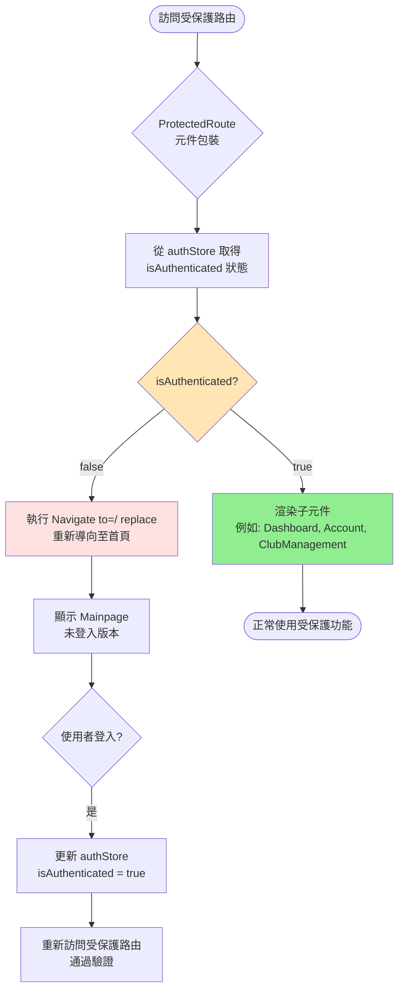

### 受保護的路由列表
```typescript
// 來自 App.tsx（6 個 Protected Routes）
/dashboard                  → Dashboard
/account                    → Account
/clubs/create               → ClubCreate
/clubs/:id/management       → ClubManagement
/discussions/new            → DiscussionNew
/comments/:id/edit          → CommentEdit
```

### 關鍵說明
- **實作位置**：App.tsx lines 20-28
- **檢查機制**：讀取 `authStore.isAuthenticated`
- **失敗處理**：重新導向至 `/`（Mainpage）
- **成功處理**：正常渲染子元件
- **跨分頁同步**：透過 storage 事件監聽，確保多分頁登入狀態一致

---

## 10. 跨分頁認證同步機制

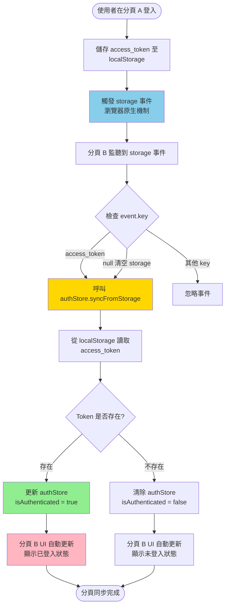

### 實作程式碼（來自 App.tsx lines 44-54）
```typescript
useEffect(() => {
  const handleStorageChange = (e: StorageEvent) => {
    if (e.key === 'access_token' || e.key === null) {
      syncFromStorage();
    }
  };
  
  window.addEventListener('storage', handleStorageChange);
  return () => window.removeEventListener('storage', handleStorageChange);
}, [syncFromStorage]);
```

### 關鍵說明
- **觸發條件**：`access_token` 變更或整個 storage 被清空（`e.key === null`）
- **同步方法**：`authStore.syncFromStorage()` 從 storage 重新讀取 token
- **UI 響應**：authStore 更新後，所有使用 `isAuthenticated` 的元件自動重新渲染
- **應用場景**：
  - 使用者在分頁 A 登入 → 分頁 B 自動更新為已登入
  - 使用者在分頁 A 登出 → 分頁 B 自動更新為未登入

---

## 11. 初始化載入流程

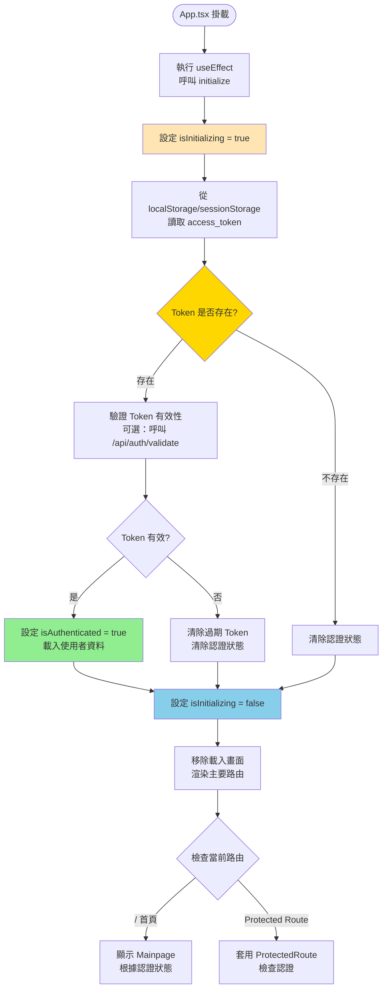

### 載入畫面（App.tsx lines 54-66）
```typescript
if (isInitializing) {
  return (
    <div className="min-h-screen flex items-center justify-center bg-gray-50">
      <div className="text-center">
        <div className="loading-spinner"></div>
        <p className="text-gray-600 mt-4">載入中...</p>
      </div>
    </div>
  );
}
```

### 關鍵說明
- **初始化時機**：App.tsx 元件掛載時立即執行
- **載入狀態**：顯示 spinner 避免閃爍
- **Token 來源**：優先 localStorage，其次 sessionStorage
- **驗證策略**：可選擇性呼叫後端 API 驗證 Token 有效性
- **完成動作**：設定 `isInitializing = false`，開始正常路由渲染

---

## 總結：與舊版流程圖的主要差異

### 1. Dashboard Tab 數量錯誤
- ❌ **舊版**：4 個 Tab（基本資訊、我的社團、討論紀錄、留言紀錄）
- ✅ **實際**：**2 個 Tab**（總覽、留言）

### 2. Account Tab 數量錯誤
- ❌ **舊版**：可能記載 6 個 Tab
- ✅ **實際**：**4 個 Tab**（個人設定、通知、我的社團、我的留言）

### 3. 元件名稱不一致
- ❌ **舊版**：使用假設的元件名稱（如 `DashboardBasic`、`Account/Club`）
- ✅ **實際**：
  - Dashboard: `DashboardBasic.tsx`、`DashboardComment.tsx`
  - Account: `Setting.tsx`、`Notify.tsx`、`Club.tsx`、`Comment.tsx`

### 4. ClubManagement Tab 結構
- ❌ **舊版**：可能記載固定 4 個 Tab
- ✅ **實際**：**動態 3-4 個 Tab**（根據使用者是否為創辦人）
  - 基本 3 個：社團資訊、成員管理、加入申請
  - 創辦人額外：轉移擁有權

### 5. 路由路徑
- ✅ **已驗證**：所有路由路徑與 App.tsx 一致
  - 公開路由：7 個
  - 受保護路由：6 個

### 6. 認證機制
- ✅ **已更新**：詳細說明 `ProtectedRoute`、`initialize()`、`syncFromStorage()` 流程

### 7. 跨分頁同步
- ✅ **已新增**：舊版可能未提及此機制，現已完整記載

---

**本文檔已根據實際前端程式碼完全重新設計，確保所有流程圖與實作一致。**
