# BookClub 介面流程圖文檔

## 📋 目錄

1. [系統整體架構](#系統整體架構)
2. [使用者認證流程](#使用者認證流程)
3. [主頁面流程](#主頁面流程)
4. [儀表板流程](#儀表板流程)
5. [社團相關流程](#社團相關流程)
6. [討論區流程](#討論區流程)
7. [個人帳戶流程](#個人帳戶流程)
8. [社團管理流程](#社團管理流程)

---

## 系統整體架構

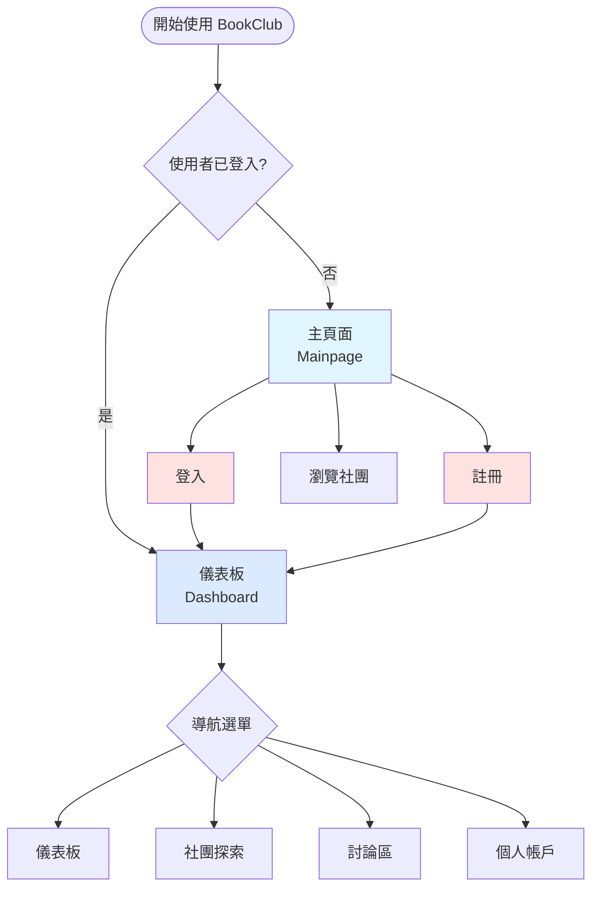
```mermaid
graph TB
    Start([開始使用 BookClub]) --> CheckAuth{使用者已登入?}
    
    CheckAuth -->|否| MainPage[主頁面<br/>Mainpage]
    CheckAuth -->|是| Dashboard[儀表板<br/>Dashboard]
    
    MainPage --> Login[登入]
    MainPage --> Register[註冊]
    MainPage --> BrowseClubs[瀏覽社團]
    
    Login --> Dashboard
    Register --> Dashboard
    
    Dashboard --> NavMenu{導航選單}
    
    NavMenu --> DashboardView[儀表板]
    NavMenu --> ClubsView[社團探索]
    NavMenu --> DiscussionsView[討論區]
    NavMenu --> AccountView[個人帳戶]
    
    style MainPage fill:#E0F5FD
    style Dashboard fill:#DBEAFE
    style Login fill:#FEE2E2
    style Register fill:#FEE2E2
```

---

## 使用者認證流程

### 登入流程

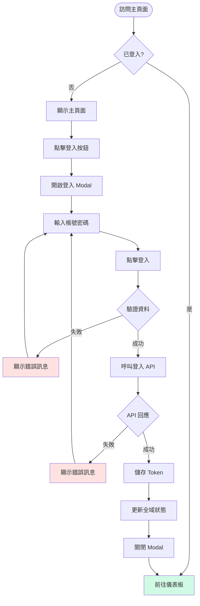
```mermaid
graph TD
    Start([訪問主頁面]) --> CheckLogin{已登入?}
    
    CheckLogin -->|是| Dashboard[前往儀表板]
    CheckLogin -->|否| ShowMain[顯示主頁面]
    
    ShowMain --> ClickLogin[點擊登入按鈕]
    ClickLogin --> OpenModal[開啟登入 Modal]
    
    OpenModal --> InputCreds[輸入帳號密碼]
    InputCreds --> ClickSubmit[點擊登入]
    
    ClickSubmit --> Validate{驗證資料}
    
    Validate -->|失敗| ShowError[顯示錯誤訊息]
    ShowError --> InputCreds
    
    Validate -->|成功| CallAPI[呼叫登入 API]
    CallAPI --> APIResponse{API 回應}
    
    APIResponse -->|失敗| ShowAPIError[顯示錯誤訊息]
    ShowAPIError --> InputCreds
    
    APIResponse -->|成功| SaveToken[儲存 Token]
    SaveToken --> UpdateStore[更新全域狀態]
    UpdateStore --> CloseModal[關閉 Modal]
    CloseModal --> Dashboard
    
    style ShowError fill:#FEE2E2
    style ShowAPIError fill:#FEE2E2
    style Dashboard fill:#D1FAE5
```

### 註冊流程

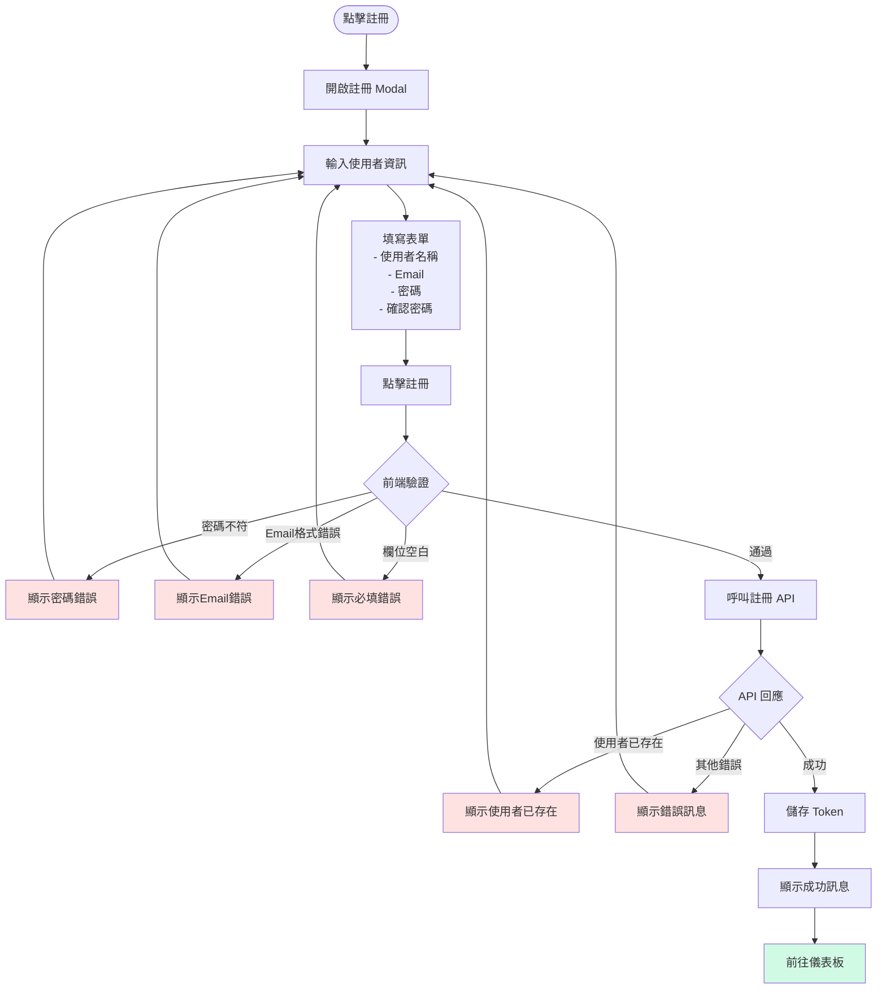
```mermaid
graph TD
    Start([點擊註冊]) --> OpenModal[開啟註冊 Modal]
    
    OpenModal --> InputInfo[輸入使用者資訊]
    InputInfo --> Fields[填寫表單<br/>- 使用者名稱<br/>- Email<br/>- 密碼<br/>- 確認密碼]
    
    Fields --> Submit[點擊註冊]
    Submit --> ClientValidate{前端驗證}
    
    ClientValidate -->|密碼不符| ErrorPwd[顯示密碼錯誤]
    ClientValidate -->|Email格式錯誤| ErrorEmail[顯示Email錯誤]
    ClientValidate -->|欄位空白| ErrorEmpty[顯示必填錯誤]
    
    ErrorPwd --> InputInfo
    ErrorEmail --> InputInfo
    ErrorEmpty --> InputInfo
    
    ClientValidate -->|通過| CallRegAPI[呼叫註冊 API]
    CallRegAPI --> APIResponse{API 回應}
    
    APIResponse -->|使用者已存在| ShowExists[顯示使用者已存在]
    APIResponse -->|其他錯誤| ShowError[顯示錯誤訊息]
    
    ShowExists --> InputInfo
    ShowError --> InputInfo
    
    APIResponse -->|成功| SaveToken[儲存 Token]
    SaveToken --> ShowSuccess[顯示成功訊息]
    ShowSuccess --> Dashboard[前往儀表板]
    
    style ErrorPwd fill:#FEE2E2
    style ErrorEmail fill:#FEE2E2
    style ErrorEmpty fill:#FEE2E2
    style ShowExists fill:#FEE2E2
    style ShowError fill:#FEE2E2
    style Dashboard fill:#D1FAE5
```

---

## 主頁面流程

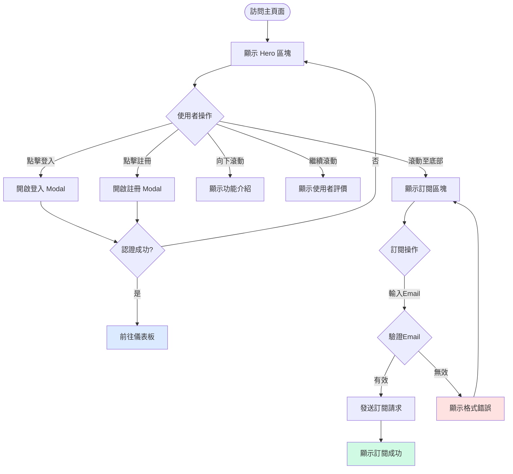
```mermaid
graph TD
    Start([訪問主頁面]) --> RenderHero[顯示 Hero 區塊]
    
    RenderHero --> UserAction{使用者操作}
    
    UserAction -->|點擊登入| LoginModal[開啟登入 Modal]
    UserAction -->|點擊註冊| RegisterModal[開啟註冊 Modal]
    UserAction -->|向下滾動| ShowFeatures[顯示功能介紹]
    UserAction -->|繼續滾動| ShowTestimonials[顯示使用者評價]
    UserAction -->|滾動至底部| ShowNewsletter[顯示訂閱區塊]
    
    LoginModal --> AuthSuccess{認證成功?}
    RegisterModal --> AuthSuccess
    
    AuthSuccess -->|是| Dashboard[前往儀表板]
    AuthSuccess -->|否| RenderHero
    
    ShowNewsletter --> SubscribeAction{訂閱操作}
    SubscribeAction -->|輸入Email| ValidateEmail{驗證Email}
    ValidateEmail -->|有效| SendSubscribe[發送訂閱請求]
    ValidateEmail -->|無效| ShowEmailError[顯示格式錯誤]
    
    SendSubscribe --> SubscribeSuccess[顯示訂閱成功]
    ShowEmailError --> ShowNewsletter
    
    style Dashboard fill:#DBEAFE
    style ShowEmailError fill:#FEE2E2
    style SubscribeSuccess fill:#D1FAE5
```

---

## 儀表板流程

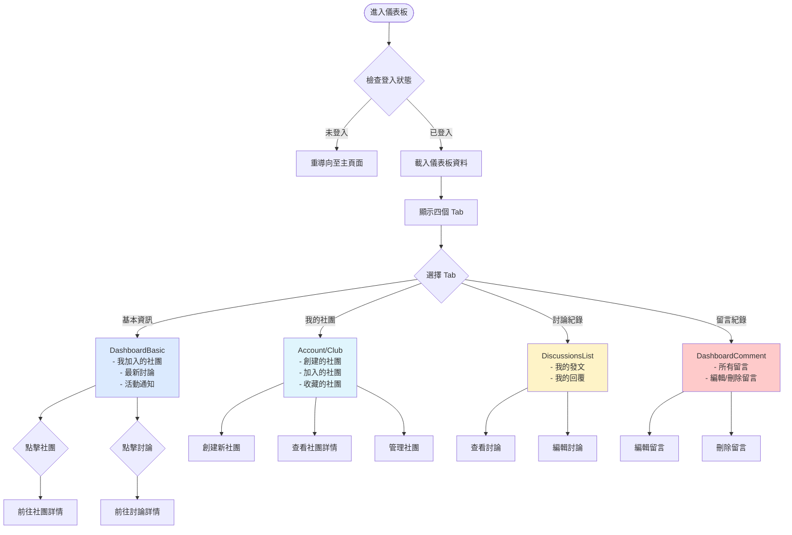
```mermaid
graph TD
    Start([進入儀表板]) --> CheckAuth{檢查登入狀態}
    
    CheckAuth -->|未登入| Redirect[重導向至主頁面]
    CheckAuth -->|已登入| LoadData[載入儀表板資料]
    
    LoadData --> ShowTabs[顯示四個 Tab]
    
    ShowTabs --> TabSelect{選擇 Tab}
    
    TabSelect -->|基本資訊| BasicInfo[DashboardBasic<br/>- 我加入的社團<br/>- 最新討論<br/>- 活動通知]
    TabSelect -->|我的社團| MyClubs[Account/Club<br/>- 創建的社團<br/>- 加入的社團<br/>- 收藏的社團]
    TabSelect -->|討論紀錄| MyDiscussions[DiscussionsList<br/>- 我的發文<br/>- 我的回覆]
    TabSelect -->|留言紀錄| MyComments[DashboardComment<br/>- 所有留言<br/>- 編輯/刪除留言]
    
    BasicInfo --> ClubClick{點擊社團}
    ClubClick --> ClubDetail[前往社團詳情]
    
    BasicInfo --> DiscussionClick{點擊討論}
    DiscussionClick --> DiscussionDetail[前往討論詳情]
    
    MyClubs --> CreateClub[創建新社團]
    MyClubs --> ViewClub[查看社團詳情]
    MyClubs --> ManageClub[管理社團]
    
    MyDiscussions --> ViewDiscussion[查看討論]
    MyDiscussions --> EditDiscussion[編輯討論]
    
    MyComments --> EditComment[編輯留言]
    MyComments --> DeleteComment[刪除留言]
    
    style BasicInfo fill:#DBEAFE
    style MyClubs fill:#E0F5FD
    style MyDiscussions fill:#FEF3C7
    style MyComments fill:#FECACA
```

---

## 社團相關流程

### 社團探索流程

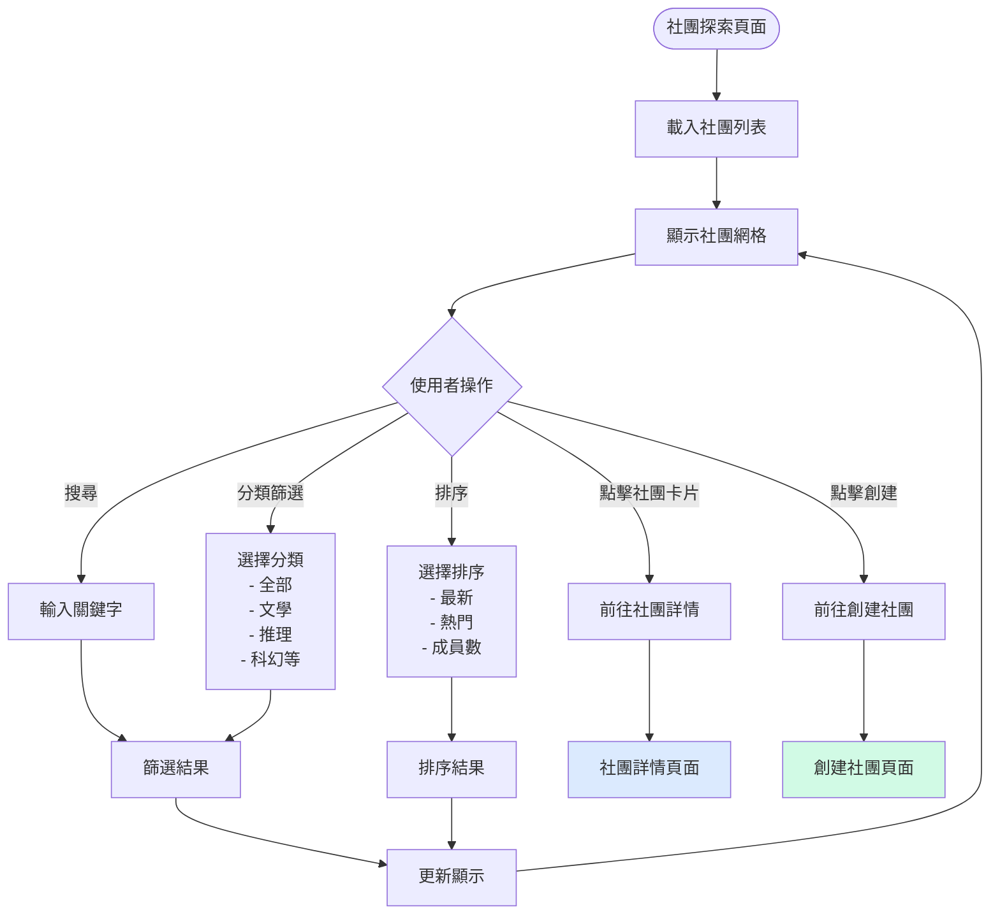
```mermaid
graph TD
    Start([社團探索頁面]) --> LoadClubs[載入社團列表]
    
    LoadClubs --> DisplayGrid[顯示社團網格]
    
    DisplayGrid --> UserAction{使用者操作}
    
    UserAction -->|搜尋| SearchInput[輸入關鍵字]
    UserAction -->|分類篩選| CategoryFilter[選擇分類<br/>- 全部<br/>- 文學<br/>- 推理<br/>- 科幻等]
    UserAction -->|排序| SortOptions[選擇排序<br/>- 最新<br/>- 熱門<br/>- 成員數]
    UserAction -->|點擊社團卡片| ViewDetail[前往社團詳情]
    UserAction -->|點擊創建| CreateClub[前往創建社團]
    
    SearchInput --> FilterResults[篩選結果]
    CategoryFilter --> FilterResults
    SortOptions --> SortResults[排序結果]
    
    FilterResults --> UpdateDisplay[更新顯示]
    SortResults --> UpdateDisplay
    UpdateDisplay --> DisplayGrid
    
    ViewDetail --> ClubDetailPage[社團詳情頁面]
    CreateClub --> CreateClubPage[創建社團頁面]
    
    style ClubDetailPage fill:#DBEAFE
    style CreateClubPage fill:#D1FAE5
```

### 社團詳情流程

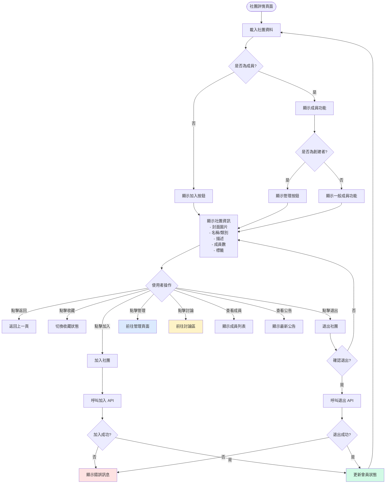
```mermaid
graph TD
    Start([社團詳情頁面]) --> LoadClubData[載入社團資料]
    
    LoadClubData --> CheckMember{是否為成員?}
    
    CheckMember -->|否| ShowJoinBtn[顯示加入按鈕]
    CheckMember -->|是| ShowMemberFeatures[顯示成員功能]
    
    ShowJoinBtn --> DisplayInfo[顯示社團資訊<br/>- 封面圖片<br/>- 名稱/類別<br/>- 描述<br/>- 成員數<br/>- 標籤]
    
    ShowMemberFeatures --> CheckOwner{是否為創建者?}
    
    CheckOwner -->|是| ShowOwnerBtn[顯示管理按鈕]
    CheckOwner -->|否| ShowMemberBtn[顯示一般成員功能]
    
    ShowOwnerBtn --> DisplayInfo
    ShowMemberBtn --> DisplayInfo
    
    DisplayInfo --> UserActions{使用者操作}
    
    UserActions -->|點擊返回| GoBack[返回上一頁]
    UserActions -->|點擊收藏| ToggleFavorite[切換收藏狀態]
    UserActions -->|點擊加入| JoinClub[加入社團]
    UserActions -->|點擊退出| LeaveClub[退出社團]
    UserActions -->|點擊管理| ManagementPage[前往管理頁面]
    UserActions -->|點擊討論| DiscussionsPage[前往討論區]
    UserActions -->|查看成員| ShowMembers[顯示成員列表]
    UserActions -->|查看公告| ShowAnnouncements[顯示最新公告]
    
    JoinClub --> APIJoin[呼叫加入 API]
    APIJoin --> JoinSuccess{加入成功?}
    JoinSuccess -->|是| UpdateStatus[更新會員狀態]
    JoinSuccess -->|否| ShowError[顯示錯誤訊息]
    
    LeaveClub --> ConfirmLeave{確認退出?}
    ConfirmLeave -->|是| APILeave[呼叫退出 API]
    ConfirmLeave -->|否| DisplayInfo
    
    APILeave --> LeaveSuccess{退出成功?}
    LeaveSuccess -->|是| UpdateStatus
    LeaveSuccess -->|否| ShowError
    
    UpdateStatus --> LoadClubData
    
    style ManagementPage fill:#DBEAFE
    style DiscussionsPage fill:#FEF3C7
    style ShowError fill:#FEE2E2
    style UpdateStatus fill:#D1FAE5
```

### 創建社團流程

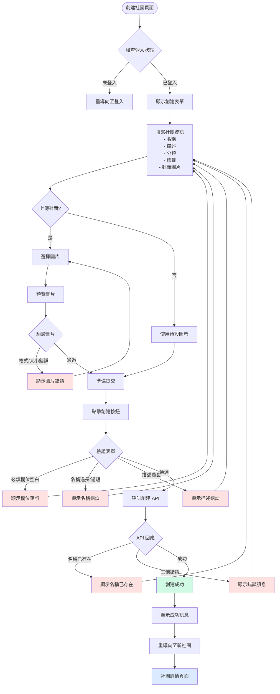
```mermaid
graph TD
    Start([創建社團頁面]) --> CheckAuth{檢查登入狀態}
    
    CheckAuth -->|未登入| RedirectLogin[重導向至登入]
    CheckAuth -->|已登入| ShowForm[顯示創建表單]
    
    ShowForm --> InputFields[填寫社團資訊<br/>- 名稱<br/>- 描述<br/>- 分類<br/>- 標籤<br/>- 封面圖片]
    
    InputFields --> UploadCover{上傳封面?}
    
    UploadCover -->|是| SelectImage[選擇圖片]
    UploadCover -->|否| UseDefault[使用預設圖示]
    
    SelectImage --> PreviewImage[預覽圖片]
    PreviewImage --> ValidateImage{驗證圖片}
    
    ValidateImage -->|格式/大小錯誤| ShowImageError[顯示圖片錯誤]
    ValidateImage -->|通過| ReadySubmit[準備提交]
    
    ShowImageError --> SelectImage
    UseDefault --> ReadySubmit
    
    ReadySubmit --> ClickSubmit[點擊創建按鈕]
    
    ClickSubmit --> ValidateForm{驗證表單}
    
    ValidateForm -->|必填欄位空白| ShowFormError[顯示欄位錯誤]
    ValidateForm -->|名稱過長/過短| ShowNameError[顯示名稱錯誤]
    ValidateForm -->|描述過長| ShowDescError[顯示描述錯誤]
    
    ShowFormError --> InputFields
    ShowNameError --> InputFields
    ShowDescError --> InputFields
    
    ValidateForm -->|通過| CallCreateAPI[呼叫創建 API]
    
    CallCreateAPI --> APIResponse{API 回應}
    
    APIResponse -->|名稱已存在| ShowExistsError[顯示名稱已存在]
    APIResponse -->|其他錯誤| ShowAPIError[顯示錯誤訊息]
    APIResponse -->|成功| CreateSuccess[創建成功]
    
    ShowExistsError --> InputFields
    ShowAPIError --> InputFields
    
    CreateSuccess --> ShowSuccessMsg[顯示成功訊息]
    ShowSuccessMsg --> RedirectToClub[重導向至新社團]
    
    RedirectToClub --> ClubDetail[社團詳情頁面]
    
    style ShowFormError fill:#FEE2E2
    style ShowNameError fill:#FEE2E2
    style ShowDescError fill:#FEE2E2
    style ShowImageError fill:#FEE2E2
    style ShowExistsError fill:#FEE2E2
    style ShowAPIError fill:#FEE2E2
    style CreateSuccess fill:#D1FAE5
    style ClubDetail fill:#DBEAFE
```

---

## 社團管理流程

### 管理主流程

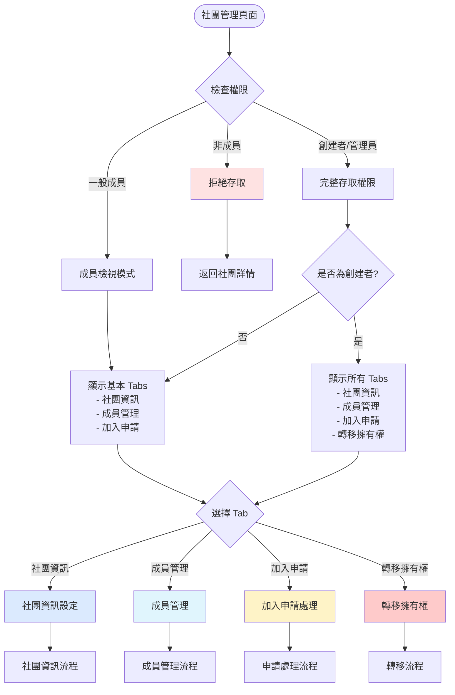
```mermaid
graph TD
    Start([社團管理頁面]) --> CheckPermission{檢查權限}
    
    CheckPermission -->|非成員| AccessDenied[拒絕存取]
    CheckPermission -->|一般成員| MemberView[成員檢視模式]
    CheckPermission -->|創建者/管理員| FullAccess[完整存取權限]
    
    AccessDenied --> RedirectBack[返回社團詳情]
    
    MemberView --> ShowBasicTabs[顯示基本 Tabs<br/>- 社團資訊<br/>- 成員管理<br/>- 加入申請]
    
    FullAccess --> CheckOwner{是否為創建者?}
    
    CheckOwner -->|否| ShowBasicTabs
    CheckOwner -->|是| ShowAllTabs[顯示所有 Tabs<br/>- 社團資訊<br/>- 成員管理<br/>- 加入申請<br/>- 轉移擁有權]
    
    ShowBasicTabs --> TabSelection{選擇 Tab}
    ShowAllTabs --> TabSelection
    
    TabSelection -->|社團資訊| InfoTab[社團資訊設定]
    TabSelection -->|成員管理| MemberTab[成員管理]
    TabSelection -->|加入申請| RequestTab[加入申請處理]
    TabSelection -->|轉移擁有權| TransferTab[轉移擁有權]
    
    InfoTab --> InfoFlow[社團資訊流程]
    MemberTab --> MemberFlow[成員管理流程]
    RequestTab --> RequestFlow[申請處理流程]
    TransferTab --> TransferFlow[轉移流程]
    
    style AccessDenied fill:#FEE2E2
    style InfoTab fill:#DBEAFE
    style MemberTab fill:#E0F5FD
    style RequestTab fill:#FEF3C7
    style TransferTab fill:#FECACA
```

### 社團資訊設定流程

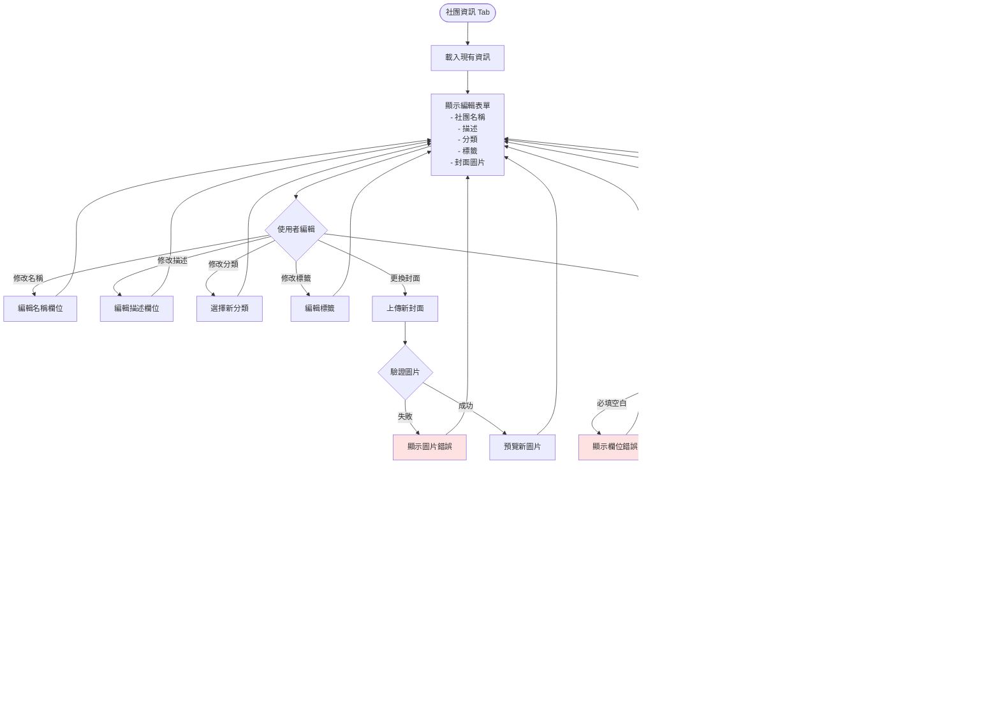
```mermaid
graph TD
    Start([社團資訊 Tab]) --> LoadInfo[載入現有資訊]
    
    LoadInfo --> DisplayForm[顯示編輯表單<br/>- 社團名稱<br/>- 描述<br/>- 分類<br/>- 標籤<br/>- 封面圖片]
    
    DisplayForm --> UserEdit{使用者編輯}
    
    UserEdit -->|修改名稱| EditName[編輯名稱欄位]
    UserEdit -->|修改描述| EditDesc[編輯描述欄位]
    UserEdit -->|修改分類| SelectCategory[選擇新分類]
    UserEdit -->|修改標籤| EditTags[編輯標籤]
    UserEdit -->|更換封面| UploadNewCover[上傳新封面]
    UserEdit -->|點擊儲存| SaveChanges[儲存變更]
    
    EditName --> DisplayForm
    EditDesc --> DisplayForm
    SelectCategory --> DisplayForm
    EditTags --> DisplayForm
    
    UploadNewCover --> ValidateImage{驗證圖片}
    ValidateImage -->|失敗| ShowImageError[顯示圖片錯誤]
    ValidateImage -->|成功| PreviewImage[預覽新圖片]
    
    ShowImageError --> DisplayForm
    PreviewImage --> DisplayForm
    
    SaveChanges --> ValidateChanges{驗證變更}
    
    ValidateChanges -->|必填空白| ShowFieldError[顯示欄位錯誤]
    ValidateChanges -->|格式錯誤| ShowFormatError[顯示格式錯誤]
    
    ShowFieldError --> DisplayForm
    ShowFormatError --> DisplayForm
    
    ValidateChanges -->|通過| CallUpdateAPI[呼叫更新 API]
    
    CallUpdateAPI --> APIResponse{API 回應}
    
    APIResponse -->|失敗| ShowAPIError[顯示錯誤訊息]
    APIResponse -->|成功| UpdateSuccess[更新成功]
    
    ShowAPIError --> DisplayForm
    
    UpdateSuccess --> ShowSuccessMsg[顯示成功訊息]
    ShowSuccessMsg --> ReloadInfo[重新載入資訊]
    ReloadInfo --> DisplayForm
    
    style ShowImageError fill:#FEE2E2
    style ShowFieldError fill:#FEE2E2
    style ShowFormatError fill:#FEE2E2
    style ShowAPIError fill:#FEE2E2
    style UpdateSuccess fill:#D1FAE5
```

### 成員管理流程

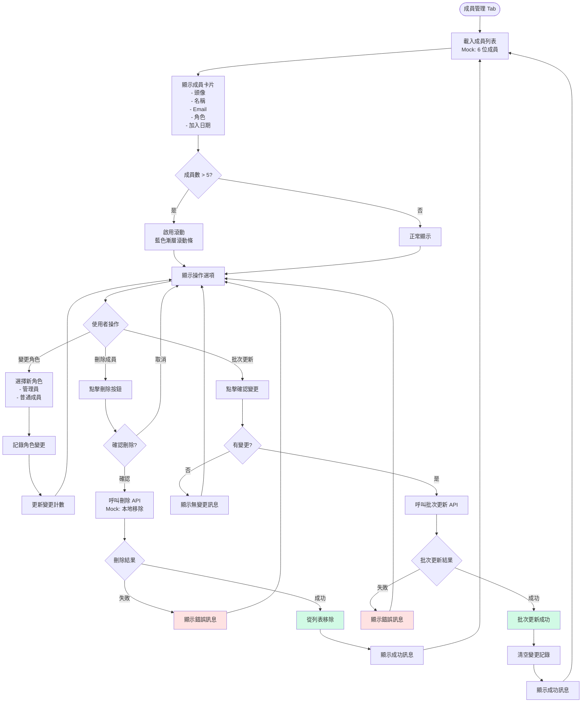
```mermaid
graph TD
    Start([成員管理 Tab]) --> LoadMembers[載入成員列表<br/>Mock: 6 位成員]
    
    LoadMembers --> DisplayList[顯示成員卡片<br/>- 頭像<br/>- 名稱<br/>- Email<br/>- 角色<br/>- 加入日期]
    
    DisplayList --> CheckScroll{成員數 > 5?}
    
    CheckScroll -->|是| EnableScroll[啟用滾動<br/>藍色漸層滾動條]
    CheckScroll -->|否| NoScroll[正常顯示]
    
    EnableScroll --> ShowActions[顯示操作選項]
    NoScroll --> ShowActions
    
    ShowActions --> UserAction{使用者操作}
    
    UserAction -->|變更角色| SelectRole[選擇新角色<br/>- 管理員<br/>- 普通成員]
    UserAction -->|刪除成員| ClickDelete[點擊刪除按鈕]
    UserAction -->|批次更新| BatchUpdate[點擊確認變更]
    
    SelectRole --> TrackChanges[記錄角色變更]
    TrackChanges --> UpdateCount[更新變更計數]
    UpdateCount --> ShowActions
    
    ClickDelete --> ConfirmDelete{確認刪除?}
    ConfirmDelete -->|取消| ShowActions
    ConfirmDelete -->|確認| CallDeleteAPI[呼叫刪除 API<br/>Mock: 本地移除]
    
    CallDeleteAPI --> DeleteResponse{刪除結果}
    DeleteResponse -->|失敗| ShowDeleteError[顯示錯誤訊息]
    DeleteResponse -->|成功| RemoveMember[從列表移除]
    
    ShowDeleteError --> ShowActions
    RemoveMember --> ShowDeleteSuccess[顯示成功訊息]
    ShowDeleteSuccess --> LoadMembers
    
    BatchUpdate --> HasChanges{有變更?}
    HasChanges -->|否| NoChangesMsg[顯示無變更訊息]
    HasChanges -->|是| CallBatchAPI[呼叫批次更新 API]
    
    NoChangesMsg --> ShowActions
    
    CallBatchAPI --> BatchResponse{批次更新結果}
    BatchResponse -->|失敗| ShowBatchError[顯示錯誤訊息]
    BatchResponse -->|成功| BatchSuccess[批次更新成功]
    
    ShowBatchError --> ShowActions
    BatchSuccess --> ClearChanges[清空變更記錄]
    ClearChanges --> ShowBatchSuccess[顯示成功訊息]
    ShowBatchSuccess --> LoadMembers
    
    style ShowDeleteError fill:#FEE2E2
    style ShowBatchError fill:#FEE2E2
    style RemoveMember fill:#D1FAE5
    style BatchSuccess fill:#D1FAE5
```

### 加入申請處理流程

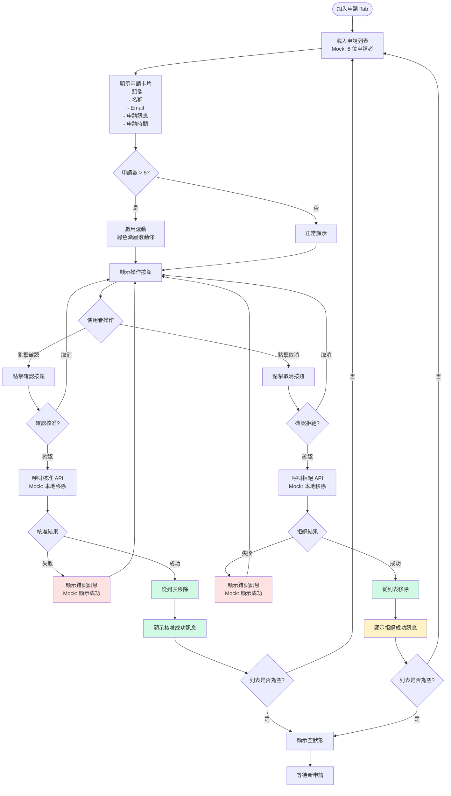
```mermaid
graph TD
    Start([加入申請 Tab]) --> LoadRequests[載入申請列表<br/>Mock: 6 位申請者]
    
    LoadRequests --> DisplayRequests[顯示申請卡片<br/>- 頭像<br/>- 名稱<br/>- Email<br/>- 申請訊息<br/>- 申請時間]
    
    DisplayRequests --> CheckScroll{申請數 > 5?}
    
    CheckScroll -->|是| EnableScroll[啟用滾動<br/>綠色漸層滾動條]
    CheckScroll -->|否| NoScroll[正常顯示]
    
    EnableScroll --> ShowButtons[顯示操作按鈕]
    NoScroll --> ShowButtons
    
    ShowButtons --> UserAction{使用者操作}
    
    UserAction -->|點擊確認| ClickApprove[點擊確認按鈕]
    UserAction -->|點擊取消| ClickReject[點擊取消按鈕]
    
    ClickApprove --> ConfirmApprove{確認核准?}
    ConfirmApprove -->|取消| ShowButtons
    ConfirmApprove -->|確認| CallApproveAPI[呼叫核准 API<br/>Mock: 本地移除]
    
    CallApproveAPI --> ApproveResponse{核准結果}
    ApproveResponse -->|失敗| ShowApproveError[顯示錯誤訊息<br/>Mock: 顯示成功]
    ApproveResponse -->|成功| RemoveFromList1[從列表移除]
    
    ShowApproveError --> ShowButtons
    RemoveFromList1 --> ShowApproveSuccess[顯示核准成功訊息]
    ShowApproveSuccess --> CheckEmpty1{列表是否為空?}
    
    ClickReject --> ConfirmReject{確認拒絕?}
    ConfirmReject -->|取消| ShowButtons
    ConfirmReject -->|確認| CallRejectAPI[呼叫拒絕 API<br/>Mock: 本地移除]
    
    CallRejectAPI --> RejectResponse{拒絕結果}
    RejectResponse -->|失敗| ShowRejectError[顯示錯誤訊息<br/>Mock: 顯示成功]
    RejectResponse -->|成功| RemoveFromList2[從列表移除]
    
    ShowRejectError --> ShowButtons
    RemoveFromList2 --> ShowRejectSuccess[顯示拒絕成功訊息]
    ShowRejectSuccess --> CheckEmpty2{列表是否為空?}
    
    CheckEmpty1 -->|是| ShowEmptyState[顯示空狀態]
    CheckEmpty1 -->|否| LoadRequests
    
    CheckEmpty2 -->|是| ShowEmptyState
    CheckEmpty2 -->|否| LoadRequests
    
    ShowEmptyState --> WaitNewRequest[等待新申請]
    
    style ShowApproveError fill:#FEE2E2
    style ShowRejectError fill:#FEE2E2
    style RemoveFromList1 fill:#D1FAE5
    style RemoveFromList2 fill:#D1FAE5
    style ShowApproveSuccess fill:#D1FAE5
    style ShowRejectSuccess fill:#FEF3C7
```

### 轉移擁有權流程

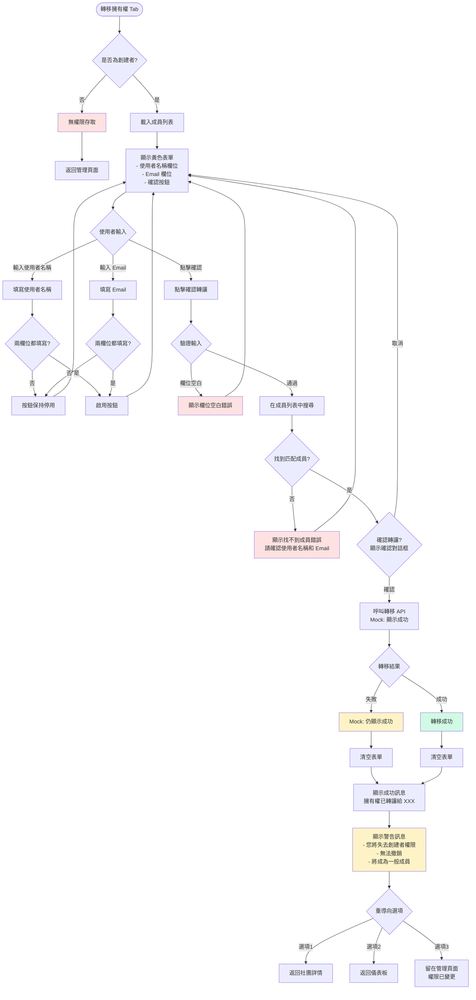
```mermaid
graph TD
    Start([轉移擁有權 Tab]) --> CheckOwner{是否為創建者?}
    
    CheckOwner -->|否| AccessDenied[無權限存取]
    CheckOwner -->|是| LoadMembers[載入成員列表]
    
    AccessDenied --> ReturnToManagement[返回管理頁面]
    
    LoadMembers --> ShowForm[顯示黃色表單<br/>- 使用者名稱欄位<br/>- Email 欄位<br/>- 確認按鈕]
    
    ShowForm --> UserInput{使用者輸入}
    
    UserInput -->|輸入使用者名稱| EnterUsername[填寫使用者名稱]
    UserInput -->|輸入 Email| EnterEmail[填寫 Email]
    UserInput -->|點擊確認| ClickTransfer[點擊確認轉讓]
    
    EnterUsername --> CheckFields1{兩欄位都填寫?}
    EnterEmail --> CheckFields2{兩欄位都填寫?}
    
    CheckFields1 -->|否| DisableButton[按鈕保持停用]
    CheckFields2 -->|否| DisableButton
    CheckFields1 -->|是| EnableButton[啟用按鈕]
    CheckFields2 -->|是| EnableButton
    
    DisableButton --> ShowForm
    EnableButton --> ShowForm
    
    ClickTransfer --> ValidateInput{驗證輸入}
    
    ValidateInput -->|欄位空白| ShowEmptyError[顯示欄位空白錯誤]
    ShowEmptyError --> ShowForm
    
    ValidateInput -->|通過| FindMember[在成員列表中搜尋]
    
    FindMember --> MatchFound{找到匹配成員?}
    
    MatchFound -->|否| ShowNoMatchError[顯示找不到成員錯誤<br/>請確認使用者名稱和 Email]
    ShowNoMatchError --> ShowForm
    
    MatchFound -->|是| ConfirmTransfer{確認轉讓?<br/>顯示確認對話框}
    
    ConfirmTransfer -->|取消| ShowForm
    ConfirmTransfer -->|確認| CallTransferAPI[呼叫轉移 API<br/>Mock: 顯示成功]
    
    CallTransferAPI --> TransferResponse{轉移結果}
    
    TransferResponse -->|失敗| ShowAPIError[Mock: 仍顯示成功]
    TransferResponse -->|成功| TransferSuccess[轉移成功]
    
    ShowAPIError --> ClearForm1[清空表單]
    TransferSuccess --> ClearForm2[清空表單]
    
    ClearForm1 --> ShowSuccessMsg[顯示成功訊息<br/>擁有權已轉讓給 XXX]
    ClearForm2 --> ShowSuccessMsg
    
    ShowSuccessMsg --> Warning[顯示警告訊息<br/>- 您將失去創建者權限<br/>- 無法撤銷<br/>- 將成為一般成員]
    
    Warning --> RedirectOptions{重導向選項}
    
    RedirectOptions -->|選項1| RedirectToClub[返回社團詳情]
    RedirectOptions -->|選項2| RedirectToDashboard[返回儀表板]
    RedirectOptions -->|選項3| StayOnPage[留在管理頁面<br/>權限已變更]
    
    style AccessDenied fill:#FEE2E2
    style ShowEmptyError fill:#FEE2E2
    style ShowNoMatchError fill:#FEE2E2
    style ShowAPIError fill:#FEF3C7
    style TransferSuccess fill:#D1FAE5
    style Warning fill:#FEF3C7
```

---

## 討論區流程

### 社團討論區流程

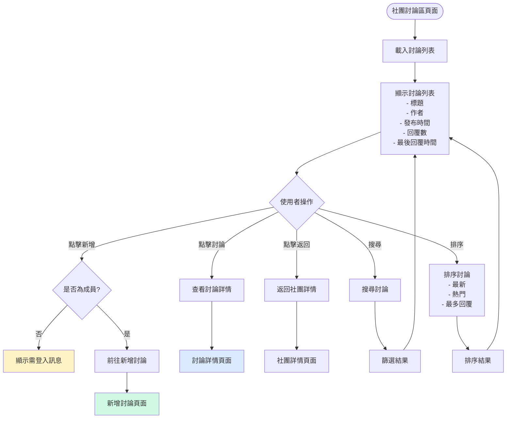
```mermaid
graph TD
    Start([社團討論區頁面]) --> LoadDiscussions[載入討論列表]
    
    LoadDiscussions --> DisplayList[顯示討論列表<br/>- 標題<br/>- 作者<br/>- 發布時間<br/>- 回覆數<br/>- 最後回覆時間]
    
    DisplayList --> UserAction{使用者操作}
    
    UserAction -->|點擊討論| ViewDiscussion[查看討論詳情]
    UserAction -->|點擊返回| BackToClub[返回社團詳情]
    UserAction -->|點擊新增| CheckMember{是否為成員?}
    UserAction -->|搜尋| SearchDiscussion[搜尋討論]
    UserAction -->|排序| SortDiscussion[排序討論<br/>- 最新<br/>- 熱門<br/>- 最多回覆]
    
    CheckMember -->|否| ShowLoginMsg[顯示需登入訊息]
    CheckMember -->|是| CreateNewDiscussion[前往新增討論]
    
    ViewDiscussion --> DiscussionDetail[討論詳情頁面]
    BackToClub --> ClubDetail[社團詳情頁面]
    CreateNewDiscussion --> NewDiscussionPage[新增討論頁面]
    
    SearchDiscussion --> FilterResults[篩選結果]
    SortDiscussion --> SortResults[排序結果]
    
    FilterResults --> DisplayList
    SortResults --> DisplayList
    
    style ShowLoginMsg fill:#FEF3C7
    style DiscussionDetail fill:#DBEAFE
    style NewDiscussionPage fill:#D1FAE5
```

### 新增討論流程

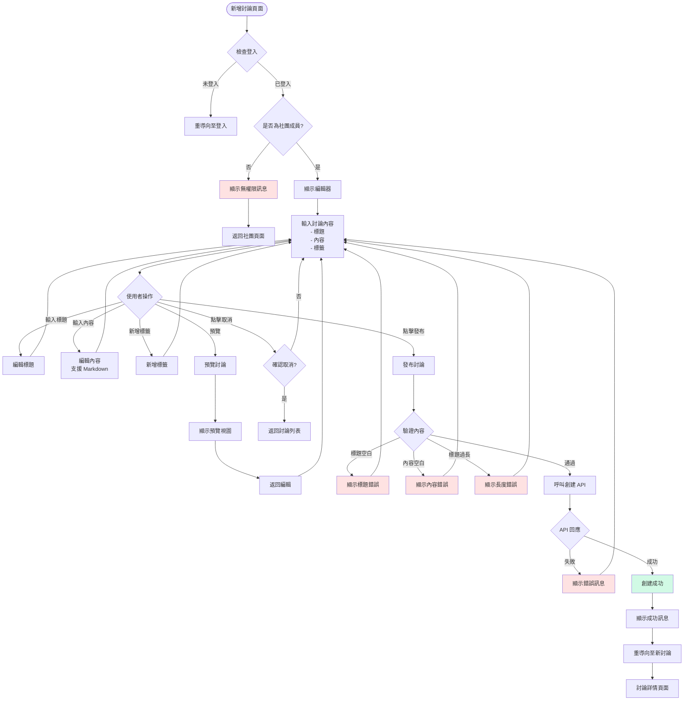
```mermaid
graph TD
    Start([新增討論頁面]) --> CheckAuth{檢查登入}
    
    CheckAuth -->|未登入| RedirectLogin[重導向至登入]
    CheckAuth -->|已登入| CheckClubMember{是否為社團成員?}
    
    CheckClubMember -->|否| AccessDenied[顯示無權限訊息]
    CheckClubMember -->|是| ShowEditor[顯示編輯器]
    
    AccessDenied --> BackToClub[返回社團頁面]
    
    ShowEditor --> InputContent[輸入討論內容<br/>- 標題<br/>- 內容<br/>- 標籤]
    
    InputContent --> UserAction{使用者操作}
    
    UserAction -->|輸入標題| EditTitle[編輯標題]
    UserAction -->|輸入內容| EditContent[編輯內容<br/>支援 Markdown]
    UserAction -->|新增標籤| AddTags[新增標籤]
    UserAction -->|預覽| PreviewPost[預覽討論]
    UserAction -->|點擊發布| PublishPost[發布討論]
    UserAction -->|點擊取消| ConfirmCancel{確認取消?}
    
    EditTitle --> InputContent
    EditContent --> InputContent
    AddTags --> InputContent
    
    PreviewPost --> ShowPreview[顯示預覽視圖]
    ShowPreview --> BackToEdit[返回編輯]
    BackToEdit --> InputContent
    
    ConfirmCancel -->|否| InputContent
    ConfirmCancel -->|是| BackToDiscussions[返回討論列表]
    
    PublishPost --> ValidatePost{驗證內容}
    
    ValidatePost -->|標題空白| ShowTitleError[顯示標題錯誤]
    ValidatePost -->|內容空白| ShowContentError[顯示內容錯誤]
    ValidatePost -->|標題過長| ShowLengthError[顯示長度錯誤]
    
    ShowTitleError --> InputContent
    ShowContentError --> InputContent
    ShowLengthError --> InputContent
    
    ValidatePost -->|通過| CallCreateAPI[呼叫創建 API]
    
    CallCreateAPI --> APIResponse{API 回應}
    
    APIResponse -->|失敗| ShowAPIError[顯示錯誤訊息]
    APIResponse -->|成功| CreateSuccess[創建成功]
    
    ShowAPIError --> InputContent
    
    CreateSuccess --> ShowSuccessMsg[顯示成功訊息]
    ShowSuccessMsg --> RedirectToPost[重導向至新討論]
    
    RedirectToPost --> DiscussionDetail[討論詳情頁面]
    
    style AccessDenied fill:#FEE2E2
    style ShowTitleError fill:#FEE2E2
    style ShowContentError fill:#FEE2E2
    style ShowLengthError fill:#FEE2E2
    style ShowAPIError fill:#FEE2E2
    style CreateSuccess fill:#D1FAE5
```

### 討論詳情流程

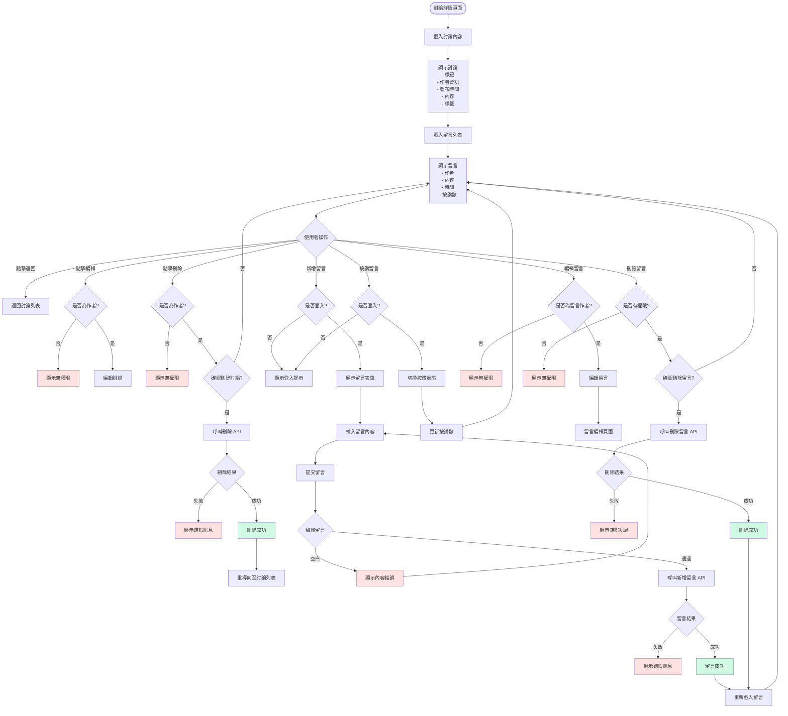
```mermaid
graph TD
    Start([討論詳情頁面]) --> LoadDiscussion[載入討論內容]
    
    LoadDiscussion --> DisplayPost[顯示討論<br/>- 標題<br/>- 作者資訊<br/>- 發布時間<br/>- 內容<br/>- 標籤]
    
    DisplayPost --> LoadComments[載入留言列表]
    
    LoadComments --> DisplayComments[顯示留言<br/>- 作者<br/>- 內容<br/>- 時間<br/>- 按讚數]
    
    DisplayComments --> UserAction{使用者操作}
    
    UserAction -->|點擊返回| BackToList[返回討論列表]
    UserAction -->|點擊編輯| CheckAuthor1{是否為作者?}
    UserAction -->|點擊刪除| CheckAuthor2{是否為作者?}
    UserAction -->|新增留言| CheckLogin1{是否登入?}
    UserAction -->|按讚留言| CheckLogin2{是否登入?}
    UserAction -->|編輯留言| CheckCommentAuthor{是否為留言作者?}
    UserAction -->|刪除留言| CheckCommentOwner{是否有權限?}
    
    CheckAuthor1 -->|否| ShowNoPermission1[顯示無權限]
    CheckAuthor1 -->|是| EditDiscussion[編輯討論]
    
    CheckAuthor2 -->|否| ShowNoPermission2[顯示無權限]
    CheckAuthor2 -->|是| ConfirmDelete{確認刪除討論?}
    
    ConfirmDelete -->|否| DisplayComments
    ConfirmDelete -->|是| CallDeleteAPI[呼叫刪除 API]
    
    CallDeleteAPI --> DeleteResponse{刪除結果}
    DeleteResponse -->|失敗| ShowDeleteError[顯示錯誤訊息]
    DeleteResponse -->|成功| DeleteSuccess[刪除成功]
    
    DeleteSuccess --> RedirectToList[重導向至討論列表]
    
    CheckLogin1 -->|否| ShowLoginPrompt[顯示登入提示]
    CheckLogin1 -->|是| ShowCommentForm[顯示留言表單]
    
    ShowCommentForm --> InputComment[輸入留言內容]
    InputComment --> SubmitComment[提交留言]
    
    SubmitComment --> ValidateComment{驗證留言}
    ValidateComment -->|空白| ShowCommentError[顯示內容錯誤]
    ValidateComment -->|通過| CallCommentAPI[呼叫新增留言 API]
    
    ShowCommentError --> InputComment
    
    CallCommentAPI --> CommentResponse{留言結果}
    CommentResponse -->|失敗| ShowCommentAPIError[顯示錯誤訊息]
    CommentResponse -->|成功| CommentSuccess[留言成功]
    
    CommentSuccess --> ReloadComments[重新載入留言]
    ReloadComments --> DisplayComments
    
    CheckLogin2 -->|否| ShowLoginPrompt
    CheckLogin2 -->|是| ToggleLike[切換按讚狀態]
    
    ToggleLike --> UpdateLikeCount[更新按讚數]
    UpdateLikeCount --> DisplayComments
    
    CheckCommentAuthor -->|否| ShowNoPermission3[顯示無權限]
    CheckCommentAuthor -->|是| EditComment[編輯留言]
    
    EditComment --> CommentEditPage[留言編輯頁面]
    
    CheckCommentOwner -->|否| ShowNoPermission4[顯示無權限]
    CheckCommentOwner -->|是| ConfirmDeleteComment{確認刪除留言?}
    
    ConfirmDeleteComment -->|否| DisplayComments
    ConfirmDeleteComment -->|是| CallDeleteCommentAPI[呼叫刪除留言 API]
    
    CallDeleteCommentAPI --> DeleteCommentResponse{刪除結果}
    DeleteCommentResponse -->|失敗| ShowDeleteCommentError[顯示錯誤訊息]
    DeleteCommentResponse -->|成功| DeleteCommentSuccess[刪除成功]
    
    DeleteCommentSuccess --> ReloadComments
    
    style ShowNoPermission1 fill:#FEE2E2
    style ShowNoPermission2 fill:#FEE2E2
    style ShowNoPermission3 fill:#FEE2E2
    style ShowNoPermission4 fill:#FEE2E2
    style ShowDeleteError fill:#FEE2E2
    style ShowCommentError fill:#FEE2E2
    style ShowCommentAPIError fill:#FEE2E2
    style ShowDeleteCommentError fill:#FEE2E2
    style DeleteSuccess fill:#D1FAE5
    style CommentSuccess fill:#D1FAE5
    style DeleteCommentSuccess fill:#D1FAE5
```

---

## 個人帳戶流程

### 帳戶主頁面流程

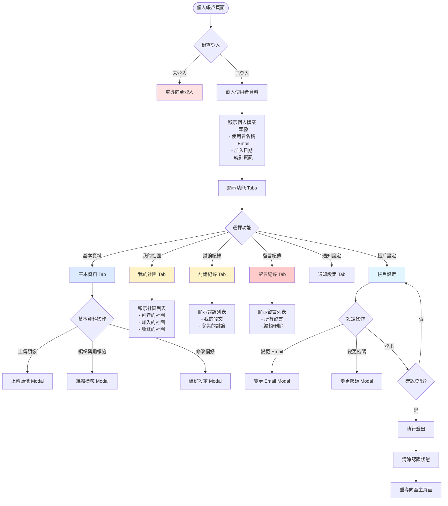
```mermaid
graph TD
    Start([個人帳戶頁面]) --> CheckAuth{檢查登入}
    
    CheckAuth -->|未登入| RedirectLogin[重導向至登入]
    CheckAuth -->|已登入| LoadUserData[載入使用者資料]
    
    LoadUserData --> DisplayProfile[顯示個人檔案<br/>- 頭像<br/>- 使用者名稱<br/>- Email<br/>- 加入日期<br/>- 統計資訊]
    
    DisplayProfile --> ShowTabs[顯示功能 Tabs]
    
    ShowTabs --> TabSelect{選擇功能}
    
    TabSelect -->|基本資料| BasicInfo[基本資料 Tab]
    TabSelect -->|我的社團| MyClubs[我的社團 Tab]
    TabSelect -->|討論紀錄| MyDiscussions[討論紀錄 Tab]
    TabSelect -->|留言紀錄| MyComments[留言紀錄 Tab]
    TabSelect -->|通知設定| Notifications[通知設定 Tab]
    TabSelect -->|帳戶設定| Settings[帳戶設定]
    
    BasicInfo --> ProfileActions{基本資料操作}
    ProfileActions -->|上傳頭像| UploadAvatar[上傳頭像 Modal]
    ProfileActions -->|編輯興趣標籤| EditTags[編輯標籤 Modal]
    ProfileActions -->|修改偏好| EditPreference[偏好設定 Modal]
    
    Settings --> SettingActions{設定操作}
    SettingActions -->|變更 Email| ChangeEmail[變更 Email Modal]
    SettingActions -->|變更密碼| ChangePassword[變更密碼 Modal]
    SettingActions -->|登出| ConfirmLogout{確認登出?}
    
    ConfirmLogout -->|否| Settings
    ConfirmLogout -->|是| Logout[執行登出]
    
    Logout --> ClearAuth[清除認證狀態]
    ClearAuth --> RedirectHome[重導向至主頁面]
    
    MyClubs --> ClubsView[顯示社團列表<br/>- 創建的社團<br/>- 加入的社團<br/>- 收藏的社團]
    
    MyDiscussions --> DiscussionsView[顯示討論列表<br/>- 我的發文<br/>- 參與的討論]
    
    MyComments --> CommentsView[顯示留言列表<br/>- 所有留言<br/>- 編輯/刪除]
    
    style RedirectLogin fill:#FEE2E2
    style BasicInfo fill:#DBEAFE
    style Settings fill:#E0F5FD
    style MyClubs fill:#FEF3C7
    style MyDiscussions fill:#FEF3C7
    style MyComments fill:#FECACA
```

### 修改個人資料流程

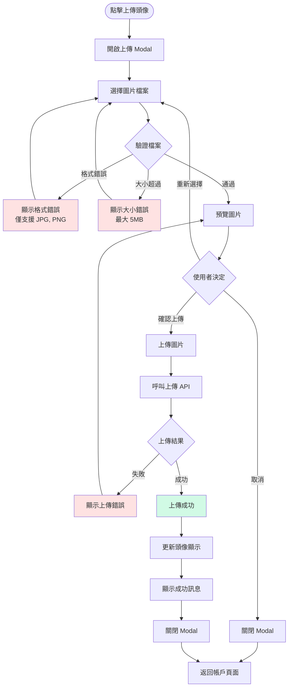
```mermaid
graph TD
    Start([點擊上傳頭像]) --> OpenModal[開啟上傳 Modal]
    
    OpenModal --> SelectFile[選擇圖片檔案]
    
    SelectFile --> ValidateFile{驗證檔案}
    
    ValidateFile -->|格式錯誤| ShowFormatError[顯示格式錯誤<br/>僅支援 JPG, PNG]
    ValidateFile -->|大小超過| ShowSizeError[顯示大小錯誤<br/>最大 5MB]
    ValidateFile -->|通過| PreviewImage[預覽圖片]
    
    ShowFormatError --> SelectFile
    ShowSizeError --> SelectFile
    
    PreviewImage --> UserDecision{使用者決定}
    
    UserDecision -->|重新選擇| SelectFile
    UserDecision -->|確認上傳| UploadImage[上傳圖片]
    UserDecision -->|取消| CloseModal1[關閉 Modal]
    
    UploadImage --> CallUploadAPI[呼叫上傳 API]
    
    CallUploadAPI --> UploadResponse{上傳結果}
    
    UploadResponse -->|失敗| ShowUploadError[顯示上傳錯誤]
    UploadResponse -->|成功| UploadSuccess[上傳成功]
    
    ShowUploadError --> PreviewImage
    
    UploadSuccess --> UpdateAvatar[更新頭像顯示]
    UpdateAvatar --> ShowSuccessMsg[顯示成功訊息]
    ShowSuccessMsg --> CloseModal2[關閉 Modal]
    
    CloseModal1 --> AccountPage[返回帳戶頁面]
    CloseModal2 --> AccountPage
    
    style ShowFormatError fill:#FEE2E2
    style ShowSizeError fill:#FEE2E2
    style ShowUploadError fill:#FEE2E2
    style UploadSuccess fill:#D1FAE5
```

### 變更密碼流程

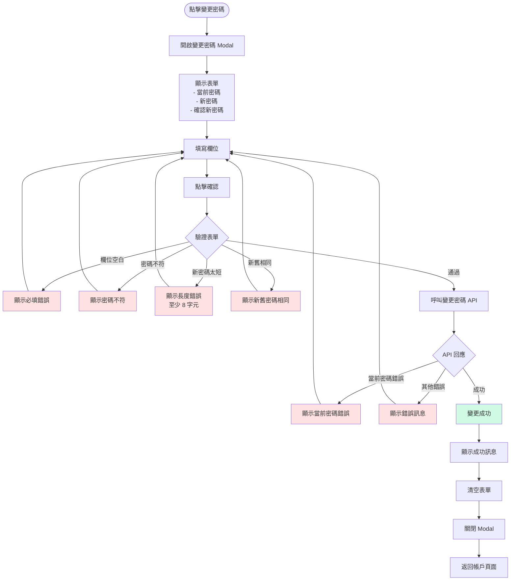
```mermaid
graph TD
    Start([點擊變更密碼]) --> OpenModal[開啟變更密碼 Modal]
    
    OpenModal --> ShowForm[顯示表單<br/>- 當前密碼<br/>- 新密碼<br/>- 確認新密碼]
    
    ShowForm --> InputFields[填寫欄位]
    
    InputFields --> SubmitForm[點擊確認]
    
    SubmitForm --> ValidateForm{驗證表單}
    
    ValidateForm -->|欄位空白| ShowEmptyError[顯示必填錯誤]
    ValidateForm -->|密碼不符| ShowMismatchError[顯示密碼不符]
    ValidateForm -->|新密碼太短| ShowLengthError[顯示長度錯誤<br/>至少 8 字元]
    ValidateForm -->|新舊相同| ShowSameError[顯示新舊密碼相同]
    
    ShowEmptyError --> InputFields
    ShowMismatchError --> InputFields
    ShowLengthError --> InputFields
    ShowSameError --> InputFields
    
    ValidateForm -->|通過| CallChangeAPI[呼叫變更密碼 API]
    
    CallChangeAPI --> APIResponse{API 回應}
    
    APIResponse -->|當前密碼錯誤| ShowCurrentPwdError[顯示當前密碼錯誤]
    APIResponse -->|其他錯誤| ShowAPIError[顯示錯誤訊息]
    APIResponse -->|成功| ChangeSuccess[變更成功]
    
    ShowCurrentPwdError --> InputFields
    ShowAPIError --> InputFields
    
    ChangeSuccess --> ShowSuccessMsg[顯示成功訊息]
    ShowSuccessMsg --> ClearForm[清空表單]
    ClearForm --> CloseModal[關閉 Modal]
    
    CloseModal --> AccountPage[返回帳戶頁面]
    
    style ShowEmptyError fill:#FEE2E2
    style ShowMismatchError fill:#FEE2E2
    style ShowLengthError fill:#FEE2E2
    style ShowSameError fill:#FEE2E2
    style ShowCurrentPwdError fill:#FEE2E2
    style ShowAPIError fill:#FEE2E2
    style ChangeSuccess fill:#D1FAE5
```

---

## 完整使用者旅程範例

### 新使用者完整流程

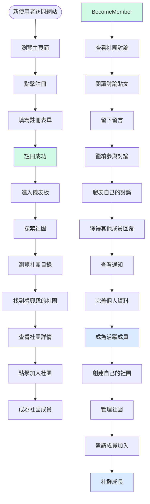
```mermaid
graph TD
    Start([新使用者訪問網站]) --> ViewMainpage[瀏覽主頁面]
    
    ViewMainpage --> RegisterAction[點擊註冊]
    RegisterAction --> FillRegForm[填寫註冊表單]
    FillRegForm --> RegisterSuccess[註冊成功]
    
    RegisterSuccess --> Dashboard[進入儀表板]
    
    Dashboard --> ExploreClubs[探索社團]
    ExploreClubs --> BrowseDirectory[瀏覽社團目錄]
    
    BrowseDirectory --> FindInterest[找到感興趣的社團]
    FindInterest --> ViewClubDetail[查看社團詳情]
    
    ViewClubDetail --> JoinClub[點擊加入社團]
    JoinClub --> BecomeMembe[成為社團成員]
    
    BecomeMember --> ViewDiscussions[查看社團討論]
    ViewDiscussions --> ReadPost[閱讀討論貼文]
    
    ReadPost --> LeaveComment[留下留言]
    LeaveComment --> EngageMore[繼續參與討論]
    
    EngageMore --> CreateOwnPost[發表自己的討論]
    CreateOwnPost --> GetReplies[獲得其他成員回覆]
    
    GetReplies --> CheckNotifications[查看通知]
    CheckNotifications --> UpdateProfile[完善個人資料]
    
    UpdateProfile --> ActiveMember[成為活躍成員]
    
    ActiveMember --> CreateOwnClub[創建自己的社團]
    CreateOwnClub --> ManageClub[管理社團]
    
    ManageClub --> InviteMembers[邀請成員加入]
    InviteMembers --> GrowCommunity[社群成長]
    
    style RegisterSuccess fill:#D1FAE5
    style BecomeMember fill:#D1FAE5
    style ActiveMember fill:#DBEAFE
    style GrowCommunity fill:#DBEAFE
```

---

## 附錄：路由對照表

| 路徑 | 組件 | 權限 | 說明 |
|------|------|------|------|
| `/` | Mainpage | 公開 | 主頁面 |
| `/dashboard` | Dashboard | 需登入 | 儀表板 |
| `/account` | Account | 需登入 | 個人帳戶 |
| `/clubs` | ClubDirectory | 公開 | 社團目錄 |
| `/clubs/:id` | ClubDetail | 公開 | 社團詳情 |
| `/clubs/create` | ClubCreate | 需登入 | 創建社團 |
| `/clubs/:id/management` | ClubManagement | 需登入+成員 | 社團管理 |
| `/club/:id/discussions` | ClubDiscussions | 公開 | 社團討論區 |
| `/discussions` | Discussions | 公開 | 全站討論 |
| `/discussions/:id` | DiscussionDetail | 公開 | 討論詳情 |
| `/discussions/new` | DiscussionNew | 需登入 | 新增討論 |
| `/comments/:id/edit` | CommentEdit | 需登入+作者 | 編輯留言 |

---

## 狀態管理概覽

### 全域狀態 (Zustand Stores)

```mermaid
graph TB
    subgraph "認證狀態 - useAuthStore"
        Auth1[isAuthenticated]
        Auth2[user]
        Auth3[token]
        Auth4[login/logout/register]
    end
    
    subgraph "社團狀態 - useBookClubStore"
        Club1[clubs]
        Club2[detailClub]
        Club3[myClubs]
        Club4[fetchClubs/joinClub]
    end
    
    subgraph "社團管理狀態 - useClubManagementStore"
        Mgmt1[members]
        Mgmt2[joinRequests]
        Mgmt3[updateMemberRole]
        Mgmt4[transferOwnership]
    end
    
    subgraph "討論狀態 - useDiscussionStore"
        Disc1[discussions]
        Disc2[currentDiscussion]
        Disc3[createDiscussion]
        Disc4[addComment]
    end
    
    Components[React 組件] --> Auth1
    Components --> Club1
    Components --> Mgmt1
    Components --> Disc1
    
    style Auth1 fill:#E0F5FD
    style Club1 fill:#DBEAFE
    style Mgmt1 fill:#FEF3C7
    style Disc1 fill:#FEE2E2
```

---

## 版本資訊

- **文檔版本**: 1.0
- **建立日期**: 2025-01-04
- **最後更新**: 2025-01-04
- **適用系統版本**: BookClub Frontend v1.0

---

## 變更日誌

### 2025-01-04
- 初版建立
- 包含所有主要介面流程圖
- 新增社團管理詳細流程（包含最新的轉移擁有權簡化設計）
- 新增討論區完整流程
- 新增個人帳戶流程
