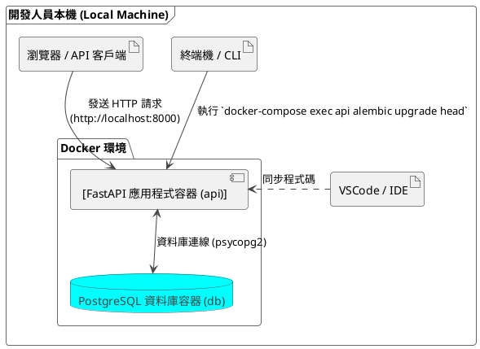

# 後端架構圖

本文檔包含開發環境與生產環境的後端架構圖及其詳細說明。

---

### 後端開發環境架構圖

開發環境利用 Docker Compose 在本機模擬一個獨立的、與生產環境相似的微服務架構。開發者可以在本機上進行編碼、測試和除錯。



**架構解說：**

1.  **開發人員**：在自己的電腦上使用 VSCode 或其他 IDE 編輯 Python 程式碼。
2.  **Docker Compose**：透過 `docker-compose.yml` 文件來定義和管理多個容器服務。
3.  **FastAPI 應用程式容器 (`api`)**：
    *   基於專案根目錄下的 `Dockerfile` 來建置。
    *   安裝 `requirements.txt` 中定義的所有 Python 套件（如 FastAPI, Uvicorn, SQLModel, Alembic）。
    *   運行 Uvicorn 伺服器來啟動 FastAPI 應用程式。
    *   將容器的 8000 連接埠映射到本機的 8000 連接埠，讓開發者可以透過 `http://localhost:8000` 存取 API。
4.  **PostgreSQL 資料庫容器 (`db`)**：
    *   使用官方的 PostgreSQL 映像。
    *   資料庫的資料會掛載到本機的 volume，確保容器重啟後資料不會遺失。
5.  **互動流程**：
    *   開發者執行 `docker-compose up` 來啟動所有服務。
    *   FastAPI 應用程式會連接到 `db` 容器中的 PostgreSQL 資料庫。
    *   當需要進行資料庫遷移時，開發者會執行 `docker-compose exec api alembic upgrade head`。
    *   開發者可以使用瀏覽器或 API 測試工具來對本機的 API 進行測試。

---

### 後端生產環境架構圖 (基於 Render.com)

生產環境部署在雲端平台 Render.com 上，提供高可用性、自動擴展和自動化部署的能力。

```plantuml
@startuml
!theme vibrant

actor "使用者 (Web/Mobile App)" as User
package "GitHub" {
  component "[GitHub Repository\n(main branch)]" as Repo
}

cloud "Render.com 雲端平台" {
    component "Render Load Balancer" as LB
    database "Render Managed PostgreSQL" as ManagedDB

    package "Web Service (FastAPI)" {
        component "[FastAPI 實例 1]" as App1
        component "[...]
        component "[FastAPI 實例 N]" as AppN
    }
}

User --> LB : "HTTPS 請求"
LB --> App1 : "流量分發"
LB --> App2
LB --> AppN

App1 <--> ManagedDB : "資料庫連線"
App2 <--> ManagedDB
AppN <--> ManagedDB

Repo .> LB : "自動部署 (CI/CD)"
note on link
  1. 執行 build.sh (安裝依賴 & 執行 Alembic 遷移)
  2. 啟動服務 (uvicorn ...)
end note

@enduml
```

**架構解說：**

1.  **使用者**：透過網際網路存取前端應用，前端應用再向後端 API 發送請求。
2.  **GitHub**：作為程式碼的來源，當 `main` 分支有新的提交時，會自動觸發 Render 的部署流程。
3.  **Render.com 平台**：
    *   **自動部署 (CI/CD)**：Render 會自動從 GitHub 拉取最新的程式碼。
    *   **建置流程**：根據 `render.yaml` 的設定，執行 `build.sh` 腳本。這個腳本會安裝 Python 依賴，並執行 `alembic upgrade head` 來更新生產資料庫的結構。
    *   **Web Service**：
        *   這是一個可水平擴展的服務，Render 會根據負載自動增減 FastAPI 應用程式的實例數量。
        *   所有進來的流量會先經過 Render 的負載均衡器 (Load Balancer)，然後分發到健康的應用程式實例。
    *   **Managed PostgreSQL**：
        *   這是一個獨立、高可用的資料庫服務，由 Render 負責管理、備份和維護。
        *   Web Service 透過 Render 提供的內部安全連線資訊來存取資料庫。


