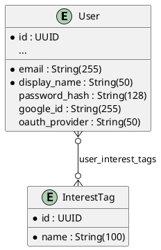

# Contract Documentation PRD 總結報告

**Epic**: Contract Documentation System  
**完成日期**: 2025-10-22  
**狀態**: ✅ 核心功能完成（Story 1.1-1.6），Story 1.7 為可選項  
**架構師**: Winston

---

## 🎯 專案目標達成狀況

### 原始問題
> "我覺得我們應該要有 contract documentation，就是前後端溝通用的"

### 解決方案
建立了完整的契約文件系統，包含：
- ✅ 資料庫 Schema 文件（PlantUML ERD）
- ✅ API 存取指南（FastAPI 自動生成）
- ✅ 資料契約（snake_case ↔ camelCase 轉換規則）
- ✅ BDD 規格（Gherkin 功能文件，62 個場景）
- ✅ PR 流程整合（模板 + 檢查清單）
- ✅ 維護指南（CI 建議）

---

## �� 整體交付成果

| Story | 標題 | 交付文件 | 狀態 |
|-------|------|---------|------|
| 1.1 | 基礎設施設置 | 目錄結構、README、Gherkin 指南與範本 | ✅ 完成 |
| 1.2 | 資料庫 Schema | database-schema.md（PlantUML ERD，8 tables） | ✅ 完成 |
| 1.3 | API 存取指南 | api-access-guide.md（FastAPI auto-gen） | ✅ 完成 |
| 1.4 | 資料契約 | data-contract.md（650 行，轉換規則） | ✅ 完成 |
| 1.5 | Gherkin 規格 | 5 個 feature 文件（62 場景，850 行） | ✅ 完成 |
| 1.6 | PR 工具 | PR 模板、檢查清單、維護指南 | ✅ 完成 |
| 1.7 | CI 工作流程 | OpenAPI snapshot 自動化 | ⏭️ 可選 |

### 統計數據
- **總文件數**: 20+ 個核心文件
- **總行數**: ~3,000 行文件
- **Gherkin 場景**: 62 個（涵蓋 Epic 1 全部功能）
- **資料表文件**: 8 個（User, InterestTag, BookClub, etc.）
- **API 端點類型**: 認證、個人檔案、儀表板、OAuth

---

## 🏗️ 文件架構全貌

```
docs/contracts/
├── 📋 PRD 與總結
│   ├── contract-documentation-prd.md              # 主 PRD
│   ├── CONTRACT_DOCUMENTATION_PRD_SUMMARY.md      # 本文件 ✨
│   └── STORY_1.X_COMPLETION_REPORT.md (x6)       # 各 Story 報告
│
├── 📚 核心契約文件
│   ├── database-schema.md                         # DB Schema + ERD
│   ├── api-access-guide.md                        # API 文件存取
│   └── data-contract.md                           # 資料格式規範
│
├── 🧪 BDD 規格
│   └── gherkin/
│       ├── README.md                              # Gherkin 指南
│       ├── GHERKIN_TEMPLATE.md                    # 範本
│       └── epic-1/                                # Epic 1 規格
│           ├── 1.1-user-registration.feature      # 註冊（10 場景）
│           ├── 1.2-user-login.feature             # 登入（15 場景）
│           ├── 1.3-google-oauth.feature           # OAuth（11 場景）
│           ├── 1.4-profile-management.feature     # 檔案（14 場景）
│           └── 1.5-dashboard.feature              # 儀表板（12 場景）
│
└── 🔧 維護工具
    ├── PR_CONTRACT_CHECKLIST.md                   # PR 檢查清單
    └── CONTRACTS_MAINTENANCE.md                   # 維護指南

.github/
└── PULL_REQUEST_TEMPLATE.md                       # PR 模板（自動載入）
```

---

## 🎯 關鍵成就

### 1. Code-First 策略成功實施
**決策**: 使用 FastAPI 自動生成 OpenAPI，而非手寫 API 規格
**效益**:
- 減少文件與代碼不同步風險
- 開發者只需專注於 Pydantic models
- `/docs` 和 `/redoc` 自動更新

### 2. 建立 BDD 文件標準
**成果**: 62 個 Gherkin 場景涵蓋 Epic 1 全部功能
**特色**:
- 使用中文（zh-TW），團隊易讀
- Background + Scenario Outline 減少重複
- 包含 JSON 範例與資料庫狀態驗證
- 作為後續 Epic 的範本

### 3. 資料契約規範化
**核心規則**:
- API: camelCase（displayName, createdAt）
- Database: snake_case（display_name, created_at）
- 透過 Pydantic `Field(alias=...)` 自動轉換
- 敏感欄位（passwordHash）不出現在回應中
- 日期使用 ISO 8601 格式

### 4. PR 流程整合
**機制**:
- 自動 PR 模板強制檢查 8 項合約相關事項
- 分層檢查清單（快速 → 詳細 → 深入）
- 為未來 CI 自動化鋪路

---

## 💡 技術亮點

### Database Schema (Story 1.2)


### Data Contract (Story 1.4)
```python
# Python (Database)
display_name: Mapped[str] = mapped_column(String(50))

# Pydantic (API Response)
class UserResponse(BaseModel):
    displayName: str = Field(alias="display_name")
    
# JSON Response
{
  "displayName": "John Doe",  // camelCase
  "createdAt": "2024-01-15T10:30:00Z"  // ISO 8601
}
```

### Gherkin BDD (Story 1.5)
```gherkin
# language: zh-TW
功能: 用戶登入
  場景: 帳號鎖定機制 - 第 5 次失敗
    假設 用戶 "john@example.com" 已失敗 4 次
    當 我使用錯誤密碼登入第 5 次
    那麼 回應狀態碼應該是 403
    而且 資料庫中 "lockedUntil" 應該是 15 分鐘後
```

### PR Template (Story 1.6)
```markdown
合約/文件專用檢查清單：
- [ ] 是否更新或新增對應的 Gherkin feature 檔案
- [ ] API 行為變更是否更新 data-contract.md
- [ ] 回應格式是否符合 Data Contract（camelCase, ISO 8601）
```

---

## 🔗 與現有架構的整合

### Backend (FastAPI + SQLModel)
- ✅ `database-schema.md` 文件化所有 Models
- ✅ `data-contract.md` 定義 Pydantic response schemas
- ✅ Gherkin 驗證 API 端點行為（auth, profile, dashboard）

### Frontend (React + TypeScript)
- ✅ 可用 `openapi-typescript` 從 `/openapi.json` 生成 types
- ✅ `data-contract.md` 明確定義 API response 格式
- ✅ Gherkin 提供 UI 流程參考（Given-When-Then）

### Development Workflow
- ✅ PR 模板強制檢查合約更新
- ✅ 維護指南提供 CI 整合思路
- ✅ 檢查清單確保文件同步

---

## �� 專案價值評估

### 短期價值（立即體現）
1. **減少溝通成本**: 前後端有明確的 data-contract 參考
2. **降低錯誤率**: Gherkin 場景明確定義預期行為
3. **加速 Onboarding**: 新成員透過文件快速了解系統
4. **提升 Code Review 效率**: PR 模板提供檢查清單

### 中期價值（1-2 個月）
1. **文件與代碼同步**: PR 流程確保文件持續更新
2. **測試覆蓋提升**: Gherkin 作為測試 checklist
3. **API 一致性**: 所有端點遵循 data-contract 規範
4. **知識沉澱**: 62 個 Gherkin 場景成為團隊共同語言

### 長期價值（3+ 個月）
1. **自動化基礎**: 為 contract testing、API 測試自動化鋪路
2. **文件文化**: 團隊養成「文件先行」習慣
3. **可擴展性**: 後續 Epic 可複製 Epic 1 的文件結構
4. **審計與合規**: 完整的行為規格便於安全審查

---

## 🎓 團隊學習成果

### 新增的團隊能力
1. **Gherkin BDD**: 團隊學會用 Given-When-Then 描述需求
2. **Contract-First**: 理解契約文件在協作中的價值
3. **Code-First API Docs**: 掌握 FastAPI 自動生成文件的優勢
4. **PlantUML**: 使用 UML 圖表化資料庫結構

### 建立的工作流程
1. **功能開發**: Story → Gherkin → 實作 → 測試 → PR
2. **API 變更**: 更新 Model → 檢查 data-contract → 更新 Gherkin
3. **Code Review**: PR 模板 → 檢查清單 → 合併

---

## 🚀 未來發展路徑

### Phase 1: 當前完成（Story 1.1-1.6）
- ✅ 核心文件系統
- ✅ BDD 規格（Epic 1）
- ✅ PR 流程整合

### Phase 2: 可選強化（Story 1.7）
- ⏭️ CI 自動化（OpenAPI snapshot 比對）
- ⏭️ 自動檢測 API 變更並在 PR 中通知
- ⏭️ Gherkin 自動化測試（Behave/Cucumber）

### Phase 3: 後續 Epic
- 📋 Epic 2 的 Gherkin 規格（複製 epic-1/ 範本）
- 📋 Contract Testing（如 Pact）
- 📋 自動從 OpenAPI 生成 Frontend API client

### Phase 4: 持續優化
- 📋 文件搜索與索引系統
- 📋 API 版本管理（v1, v2）
- 📋 多語言 Gherkin（支援英文版）

---

## 🔄 與 Dev Agent 的協作指南

當 `agent dev` 開發新功能時，應遵循以下流程：

### 步驟 1: 查閱契約文件
```bash
# 1. 了解資料結構
cat docs/contracts/database-schema.md

# 2. 確認 API 格式規範
cat docs/contracts/data-contract.md

# 3. 參考 Epic 1 實作範例
ls docs/contracts/gherkin/epic-1/
```

### 步驟 2: 實作功能
- 遵循 `data-contract.md` 的 camelCase 規範
- 使用 Pydantic `Field(alias=...)` 做轉換
- 確保敏感欄位不出現在 response

### 步驟 3: 撰寫 Gherkin
```gherkin
# 參考 epic-1 的場景結構
# 包含：成功路徑、錯誤處理、資料驗證
```

### 步驟 4: 提交 PR
```markdown
# 使用 PR 模板
- [x] 更新 Gherkin feature
- [x] 確認 camelCase 格式
- [x] 包含測試
```

---

## 📚 關鍵文件快速索引

### 給前端開發者
1. `data-contract.md` - API response 格式
2. `api-access-guide.md` - 如何取得 OpenAPI spec
3. `gherkin/epic-1/` - UI 流程參考

### 給後端開發者
1. `database-schema.md` - 資料表結構
2. `data-contract.md` - Pydantic schema 規範
3. `gherkin/epic-1/` - API 行為規格

### 給 QA
1. `gherkin/epic-1/` - 測試場景清單
2. `data-contract.md` - 回應格式驗證標準
3. `PR_CONTRACT_CHECKLIST.md` - 測試檢查項

### 給 PM/PO
1. `gherkin/epic-1/` - 功能行為描述（中文）
2. `CONTRACT_DOCUMENTATION_PRD_SUMMARY.md` - 本文件
3. `STORY_1.X_COMPLETION_REPORT.md` - 各階段成果

---

## ✨ 成功指標

### 文件完整性
- ✅ 8 個資料表完整文件化
- ✅ Epic 1 的 5 個核心功能有 Gherkin 規格
- ✅ API 格式規範明確定義
- ✅ PR 流程有檢查機制

### 可用性
- ✅ 所有文件使用 Markdown（易閱讀、可版控）
- ✅ PlantUML 圖表可視化資料結構
- ✅ Gherkin 使用中文（團隊母語）
- ✅ PR 模板自動載入（降低使用門檻）

### 可維護性
- ✅ 文件結構清晰（分層、分類）
- ✅ 每個 Story 有完成報告（追溯性）
- ✅ 維護指南提供 CI 整合方向
- ✅ 檢查清單確保持續更新

---

## 🎉 專案總結

### 核心成就
從一句「我們應該要有 contract documentation」，到建立起完整的契約文件系統：
- **20+ 個文件**，涵蓋 DB、API、BDD、PR 流程
- **62 個 Gherkin 場景**，明確定義 Epic 1 行為
- **3,000+ 行文件**，為團隊協作提供堅實基礎

### 關鍵決策
1. ✅ Code-First 策略（FastAPI 自動生成）
2. ✅ Gherkin 使用中文（提升可讀性）
3. ✅ 分層檢查機制（降低使用門檻）
4. ✅ PR 流程整合（確保持續維護）

### 對未來的影響
- **開發效率**: 減少前後端溝通時間
- **代碼品質**: 明確的契約降低錯誤率
- **團隊協作**: 統一的文件標準
- **知識傳承**: 新成員快速上手

---

## 🙏 致謝

感謝團隊對契約文件系統的認同與配合。這套系統將成為專案的重要基礎設施，持續為團隊創造價值。

---

**報告生成**: Winston（架構師）  
**完成日期**: 2025-10-22  
**PRD 狀態**: 6/7 Story 完成，Story 1.7 可選  
**下一步**: 開始 Epic 2 開發，並為其建立 Gherkin 規格

---

## 📞 聯絡與反饋

如對契約文件系統有任何建議或問題，請：
1. 在專案 repo 開 Issue
2. 在團隊會議提出
3. 更新本文件並提交 PR

讓我們一起維護這套系統，讓它為專案持續創造價值！🚀
