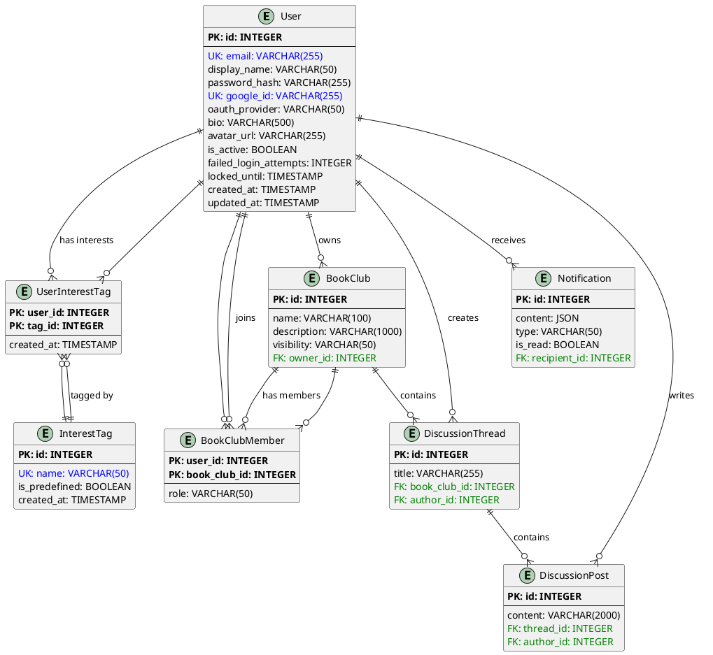

# Database Schema Documentation

**版本**: 1.0  
**最後更新**: 2025-10-22  
**擁有者**: Architect Winston  
**狀態**: ✅ 已完成（Story 1.2）  
**Current Schema Version**: c0ad6aeb438a (2025-10-22)

---

## 📋 概述

此文件記錄線上讀書會平台的完整資料庫結構，包含所有 SQLModel Models、欄位定義、關聯關係和 ERD 圖表。此文件反映 Epic 1 完成後的資料庫狀態。

**技術棧**:
- **ORM**: SQLModel (FastAPI 整合)
- **Database**: PostgreSQL 15
- **Migration Tool**: Alembic
- **Naming Convention**: snake_case

---

## 📊 Entity Relationship Diagram (ERD)



---

## 🗃️ Tables and Models

### 1. User (用戶表)

**Table Name**: `user`  
**Description**: 儲存平台用戶的核心資訊，包含傳統 Email/密碼認證和 OAuth 認證。

| Column Name | Type | Constraints | Default | Description |
|-------------|------|-------------|---------|-------------|
| `id` | INTEGER | PRIMARY KEY | AUTO | 用戶唯一識別碼 |
| `email` | VARCHAR(255) | UNIQUE, NOT NULL, INDEX | - | 用戶 Email 地址 |
| `display_name` | VARCHAR(50) | NOT NULL | - | 顯示名稱 |
| `password_hash` | VARCHAR(255) | NULLABLE | NULL | bcrypt 雜湊後的密碼 |
| `google_id` | VARCHAR(255) | UNIQUE, NULLABLE, INDEX | NULL | Google OAuth ID |
| `oauth_provider` | VARCHAR(50) | NULLABLE | NULL | OAuth 提供者（如 "google"） |
| `bio` | VARCHAR(500) | NULLABLE | NULL | 個人簡介 |
| `avatar_url` | VARCHAR(255) | NULLABLE | NULL | 頭像圖片 URL |
| `is_active` | BOOLEAN | NOT NULL | TRUE | 帳號是否啟用 |
| `failed_login_attempts` | INTEGER | NOT NULL | 0 | 登入失敗次數 |
| `locked_until` | TIMESTAMP | NULLABLE | NULL | 帳號鎖定至此時間 |
| `created_at` | TIMESTAMP | NOT NULL | CURRENT_TIMESTAMP | 建立時間 |
| `updated_at` | TIMESTAMP | NOT NULL | CURRENT_TIMESTAMP | 最後更新時間 |

**Indexes**:
- PRIMARY KEY on `id`
- UNIQUE INDEX on `email`
- UNIQUE INDEX on `google_id` (where not null)

**Relationships**:
- `owned_clubs`: One-to-Many → BookClub (owner_id)
- `memberships`: One-to-Many → BookClubMember (user_id)
- `threads`: One-to-Many → DiscussionThread (author_id)
- `posts`: One-to-Many → DiscussionPost (author_id)
- `notifications`: One-to-Many → Notification (recipient_id)
- `interest_tags`: Many-to-Many → InterestTag (via UserInterestTag)

**Business Rules**:
- Email 必須唯一且符合格式
- 密碼必須至少 8 字元，包含大小寫字母和數字
- Google ID 必須唯一（如果提供）
- 5 次登入失敗後鎖定帳號 15 分鐘

**範例資料**:
```sql
INSERT INTO user (email, display_name, password_hash, bio, is_active, created_at, updated_at)
VALUES ('john@example.com', 'John Doe', '$2b$12$...', '喜歡閱讀科技類書籍', TRUE, NOW(), NOW());
```

---

### 2. InterestTag (興趣標籤表)

**Table Name**: `interesttag`  
**Description**: 儲存用戶興趣標籤，包含系統預定義和用戶自定義標籤。

| Column Name | Type | Constraints | Default | Description |
|-------------|------|-------------|---------|-------------|
| `id` | INTEGER | PRIMARY KEY | AUTO | 標籤唯一識別碼 |
| `name` | VARCHAR(50) | UNIQUE, NOT NULL, INDEX | - | 標籤名稱 |
| `is_predefined` | BOOLEAN | NOT NULL | FALSE | 是否為系統預定義標籤 |
| `created_at` | TIMESTAMP | NOT NULL | CURRENT_TIMESTAMP | 建立時間 |

**Indexes**:
- PRIMARY KEY on `id`
- UNIQUE INDEX on `name`

**Relationships**:
- `users`: Many-to-Many → User (via UserInterestTag)

**Business Rules**:
- 標籤名稱必須唯一
- 最大長度 50 字元
- 預定義標籤不可刪除

**範例資料**:
```sql
INSERT INTO interesttag (name, is_predefined, created_at)
VALUES 
  ('技術', TRUE, NOW()),
  ('商業', TRUE, NOW()),
  ('文學', TRUE, NOW());
```

---

### 3. UserInterestTag (用戶興趣標籤關聯表)

**Table Name**: `userinteresttag`  
**Description**: Many-to-Many 關聯表，連接 User 和 InterestTag。

| Column Name | Type | Constraints | Default | Description |
|-------------|------|-------------|---------|-------------|
| `user_id` | INTEGER | PRIMARY KEY, FOREIGN KEY | - | 用戶 ID |
| `tag_id` | INTEGER | PRIMARY KEY, FOREIGN KEY | - | 標籤 ID |
| `created_at` | TIMESTAMP | NOT NULL | CURRENT_TIMESTAMP | 關聯建立時間 |

**Indexes**:
- COMPOSITE PRIMARY KEY on (`user_id`, `tag_id`)

**Foreign Keys**:
- `user_id` REFERENCES `user(id)` ON DELETE CASCADE
- `tag_id` REFERENCES `interesttag(id)` ON DELETE CASCADE

**Business Rules**:
- 每個用戶最多 20 個興趣標籤
- 同一用戶不能重複關聯同一標籤

**範例資料**:
```sql
INSERT INTO userinteresttag (user_id, tag_id, created_at)
VALUES (1, 1, NOW()), (1, 2, NOW());
```

---

### 4. BookClub (讀書會表)

**Table Name**: `bookclub`  
**Description**: 儲存讀書會基本資訊（Epic 1 建立基礎結構，Epic 2 擴展功能）。

| Column Name | Type | Constraints | Default | Description |
|-------------|------|-------------|---------|-------------|
| `id` | INTEGER | PRIMARY KEY | AUTO | 讀書會唯一識別碼 |
| `name` | VARCHAR(100) | NOT NULL, INDEX | - | 讀書會名稱 |
| `description` | VARCHAR(1000) | NULLABLE | NULL | 讀書會簡介 |
| `visibility` | VARCHAR(50) | NOT NULL | 'public' | 可見性（public/private） |
| `owner_id` | INTEGER | FOREIGN KEY, NOT NULL | - | 擁有者用戶 ID |

**Indexes**:
- PRIMARY KEY on `id`
- INDEX on `name`

**Foreign Keys**:
- `owner_id` REFERENCES `user(id)` ON DELETE CASCADE

**Relationships**:
- `owner`: Many-to-One → User
- `members`: One-to-Many → BookClubMember
- `threads`: One-to-Many → DiscussionThread

**Enums**:
```python
class BookClubVisibility(str, Enum):
    PUBLIC = "public"
    PRIVATE = "private"
```

**Business Rules**:
- 名稱最大 100 字元
- 簡介最大 1000 字元
- 擁有者不能為空

**範例資料**:
```sql
INSERT INTO bookclub (name, description, visibility, owner_id)
VALUES ('Python 讀書會', '一起學習 Python 程式設計', 'public', 1);
```

---

### 5. BookClubMember (讀書會成員關聯表)

**Table Name**: `bookclubmember`  
**Description**: 儲存讀書會成員關係和角色。

| Column Name | Type | Constraints | Default | Description |
|-------------|------|-------------|---------|-------------|
| `user_id` | INTEGER | PRIMARY KEY, FOREIGN KEY | - | 用戶 ID |
| `book_club_id` | INTEGER | PRIMARY KEY, FOREIGN KEY | - | 讀書會 ID |
| `role` | VARCHAR(50) | NOT NULL | 'member' | 成員角色 |

**Indexes**:
- COMPOSITE PRIMARY KEY on (`user_id`, `book_club_id`)

**Foreign Keys**:
- `user_id` REFERENCES `user(id)` ON DELETE CASCADE
- `book_club_id` REFERENCES `bookclub(id)` ON DELETE CASCADE

**Relationships**:
- `user`: Many-to-One → User
- `book_club`: Many-to-One → BookClub

**Enums**:
```python
class MemberRole(str, Enum):
    OWNER = "owner"
    ADMIN = "admin"
    MEMBER = "member"
```

**Business Rules**:
- 一個用戶在同一個讀書會中只能有一個角色
- Owner 角色自動創建（創建讀書會時）

**範例資料**:
```sql
INSERT INTO bookclubmember (user_id, book_club_id, role)
VALUES (1, 1, 'owner'), (2, 1, 'member');
```

---

### 6. DiscussionThread (討論主題表)

**Table Name**: `discussionthread`  
**Description**: 儲存讀書會內的討論主題。

| Column Name | Type | Constraints | Default | Description |
|-------------|------|-------------|---------|-------------|
| `id` | INTEGER | PRIMARY KEY | AUTO | 討論主題唯一識別碼 |
| `title` | VARCHAR(255) | NOT NULL | - | 討論標題 |
| `book_club_id` | INTEGER | FOREIGN KEY, NOT NULL | - | 所屬讀書會 ID |
| `author_id` | INTEGER | FOREIGN KEY, NOT NULL | - | 作者用戶 ID |

**Indexes**:
- PRIMARY KEY on `id`

**Foreign Keys**:
- `book_club_id` REFERENCES `bookclub(id)` ON DELETE CASCADE
- `author_id` REFERENCES `user(id)` ON DELETE CASCADE

**Relationships**:
- `book_club`: Many-to-One → BookClub
- `author`: Many-to-One → User
- `posts`: One-to-Many → DiscussionPost

**Business Rules**:
- 標題最大 255 字元
- 必須屬於某個讀書會

**範例資料**:
```sql
INSERT INTO discussionthread (title, book_club_id, author_id)
VALUES ('第一章討論', 1, 1);
```

---

### 7. DiscussionPost (討論回覆表)

**Table Name**: `discussionpost`  
**Description**: 儲存討論主題的回覆內容。

| Column Name | Type | Constraints | Default | Description |
|-------------|------|-------------|---------|-------------|
| `id` | INTEGER | PRIMARY KEY | AUTO | 回覆唯一識別碼 |
| `content` | VARCHAR(2000) | NOT NULL | - | 回覆內容 |
| `thread_id` | INTEGER | FOREIGN KEY, NOT NULL | - | 所屬討論主題 ID |
| `author_id` | INTEGER | FOREIGN KEY, NOT NULL | - | 作者用戶 ID |

**Indexes**:
- PRIMARY KEY on `id`

**Foreign Keys**:
- `thread_id` REFERENCES `discussionthread(id)` ON DELETE CASCADE
- `author_id` REFERENCES `user(id)` ON DELETE CASCADE

**Relationships**:
- `thread`: Many-to-One → DiscussionThread
- `author`: Many-to-One → User

**Business Rules**:
- 內容最大 2000 字元
- 必須屬於某個討論主題

**範例資料**:
```sql
INSERT INTO discussionpost (content, thread_id, author_id)
VALUES ('我覺得這一章很有趣！', 1, 2);
```

---

### 8. Notification (通知表)

**Table Name**: `notification`  
**Description**: 儲存用戶通知。

| Column Name | Type | Constraints | Default | Description |
|-------------|------|-------------|---------|-------------|
| `id` | INTEGER | PRIMARY KEY | AUTO | 通知唯一識別碼 |
| `content` | JSON | NOT NULL | - | 通知內容（JSON 格式） |
| `type` | VARCHAR(50) | NOT NULL | - | 通知類型 |
| `is_read` | BOOLEAN | NOT NULL | FALSE | 是否已讀 |
| `recipient_id` | INTEGER | FOREIGN KEY, NOT NULL | - | 接收者用戶 ID |

**Indexes**:
- PRIMARY KEY on `id`

**Foreign Keys**:
- `recipient_id` REFERENCES `user(id)` ON DELETE CASCADE

**Relationships**:
- `recipient`: Many-to-One → User

**Enums**:
```python
class NotificationType(str, Enum):
    NEW_POST = "new_post"
    NEW_MEMBER = "new_member"
```

**Business Rules**:
- content 為 JSON 格式，儲存通知詳細資訊
- type 定義通知類型

**範例資料**:
```sql
INSERT INTO notification (content, type, is_read, recipient_id)
VALUES ('{"message": "新成員加入"}', 'new_member', FALSE, 1);
```

---

## 🔄 Alembic Migration History

| Migration ID | Description | Date | Status |
|--------------|-------------|------|--------|
| `ee6dbb92555d` | Create initial tables (User, BookClub, BookClubMember, Discussion, Notification) | 2025-10-15 | ✅ Applied |
| `7c65718e9851` | Add login protection fields to User (failed_login_attempts, locked_until) | 2025-10-15 | ✅ Applied |
| `feb7a31e9ed1` | Add OAuth support to User model (google_id, oauth_provider) | 2025-10-16 | ✅ Applied |
| `26ef4d388ddb` | Add interest tags support (InterestTag, UserInterestTag) | 2025-10-19 | ✅ Applied |
| `c0ad6aeb438a` | Add user timestamps (created_at, updated_at) | 2025-10-22 | ✅ Applied |

**Current Schema Version**: `c0ad6aeb438a`

**How to check current version**:
```bash
cd backend
docker-compose exec api alembic current
```

**How to upgrade to latest**:
```bash
cd backend
docker-compose exec api alembic upgrade head
```

---

## 📋 命名規範

### Table Names
- **Convention**: snake_case, singular form
- **Examples**: `user`, `bookclub`, `interesttag`

### Column Names
- **Convention**: snake_case
- **Examples**: `display_name`, `created_at`, `is_active`

### Foreign Keys
- **Convention**: `{referenced_table}_id`
- **Examples**: `owner_id`, `user_id`, `book_club_id`

### Indexes
- **Primary Keys**: Automatically indexed
- **Foreign Keys**: Automatically indexed
- **Unique Constraints**: Automatically indexed
- **Custom Indexes**: Add `index=True` in Field definition

---

## 🔗 Relationship Patterns

### One-to-Many
```python
# Parent side (BookClub)
members: List["BookClubMember"] = Relationship(back_populates="book_club")

# Child side (BookClubMember)
book_club: "BookClub" = Relationship(back_populates="members")
```

### Many-to-Many
```python
# Through a link table (UserInterestTag)
# User side
interest_tags: List["InterestTag"] = Relationship(
    back_populates="users", 
    link_model=UserInterestTag
)

# InterestTag side
users: List["User"] = Relationship(
    back_populates="interest_tags", 
    link_model=UserInterestTag
)
```

---

## 🚧 Epic 2+ 預計擴展

以下 Models 已建立基礎結構，將在後續 Epic 中擴展：

### BookClub 擴展 (Epic 2)
- 新增欄位：`cover_image_url`, `current_book_id`, `created_at`, `updated_at`
- 新增關聯：Book, Reading Progress

### Discussion 擴展 (Epic 3)
- 新增欄位：`created_at`, `updated_at`, `is_pinned`
- 新增功能：Reactions, Attachments

### Notification 擴展 (Epic 4)
- 新增類型：Reading reminders, Club invitations
- 新增欄位：`created_at`, `read_at`

---

## 📊 資料統計與容量規劃

### Epic 1 階段預估
- **Users**: ~100 users (測試階段)
- **InterestTags**: ~50 tags (20 predefined + 30 custom)
- **BookClubs**: ~10 clubs
- **Total Tables**: 8 tables

### 效能考量
- User email 和 google_id 已建立 UNIQUE INDEX
- InterestTag name 已建立 UNIQUE INDEX
- BookClub name 已建立 INDEX（支援搜尋）

---

## 🔍 查詢範例

### 獲取用戶及其興趣標籤
```sql
SELECT u.*, it.name as tag_name
FROM user u
LEFT JOIN userinteresttag uit ON u.id = uit.user_id
LEFT JOIN interesttag it ON uit.tag_id = it.id
WHERE u.id = 1;
```

### 獲取讀書會成員列表
```sql
SELECT u.display_name, bcm.role
FROM bookclubmember bcm
JOIN user u ON bcm.user_id = u.id
WHERE bcm.book_club_id = 1;
```

### 獲取用戶的未讀通知
```sql
SELECT * FROM notification
WHERE recipient_id = 1 AND is_read = FALSE
ORDER BY id DESC;
```

---

## 📚 相關資源

- [SQLModel Documentation](https://sqlmodel.tiangolo.com/)
- [Alembic Documentation](https://alembic.sqlalchemy.org/)
- [PostgreSQL Documentation](https://www.postgresql.org/docs/)
- [Data Contract](data-contract.md) - 前後端資料格式約定
- [Maintenance Workflow](maintenance-workflow.md) - Schema 更新流程

---

## 🆘 維護指引

### 新增欄位
1. 修改對應的 Model 檔案（`backend/app/models/`）
2. 建立 Alembic migration: `alembic revision --autogenerate -m "description"`
3. 審查生成的 migration 檔案
4. 執行 migration: `alembic upgrade head`
5. **更新此文件**，記錄新欄位和 migration ID

### 新增 Model
1. 在 `backend/app/models/` 建立新的 Model 檔案
2. 在 `__init__.py` 中 import 新 Model
3. 建立 Alembic migration
4. 執行 migration
5. **更新此文件**，新增 Model 說明和 ERD

### 修改關聯
1. 修改相關 Models 的 Relationship 定義
2. 建立 migration（可能需要手動調整）
3. 測試關聯是否正確
4. **更新此文件** 和 ERD 圖表

---

**建立日期**: 2025-10-22  
**維護者**: Architect Winston  
**版本**: 1.0  
**Last Schema Update**: 2025-10-22 (c0ad6aeb438a)
