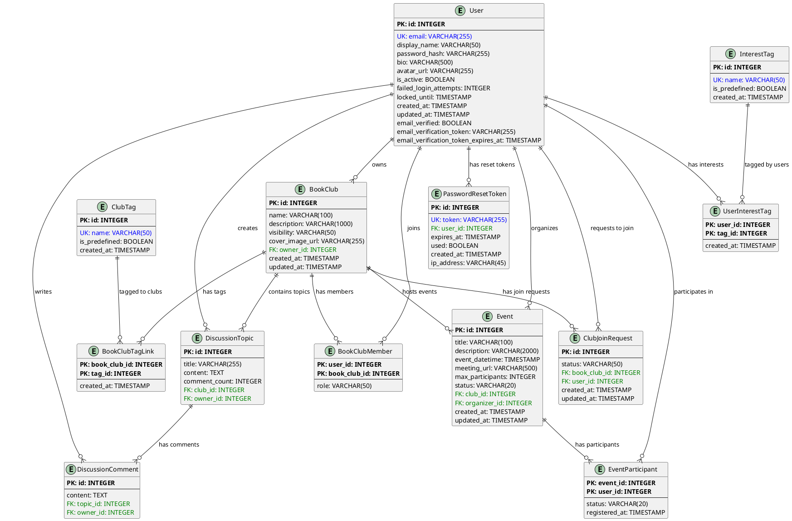
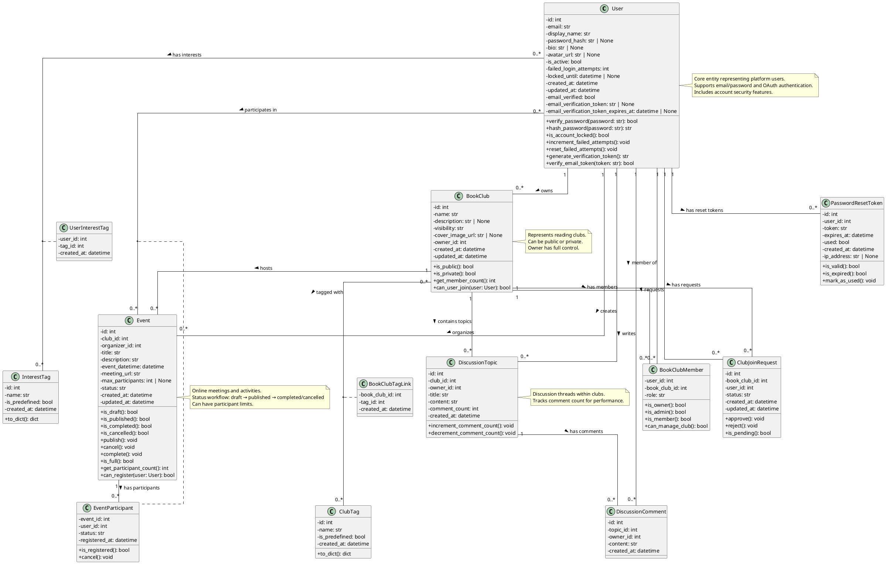

# Database Schema Documentation

**版本**: 1.3  
**最後更新**: 2025-11-08  
**擁有者**: Architect Winston, Dev James  
**狀態**: ✅ 已完成 (Story 3.3)  
**Current Schema Version**: b5b7ed9af23c

---

## 📋 概述

此文件記錄線上讀書會平台的完整資料庫結構，包含所有 SQLModel Models、欄位定義、關聯關係和 ERD 圖表。此文件反映 Epic 3 完成後的資料庫狀態。

**涵蓋範圍**:
- ✅ Epic 1: 用戶認證與個人檔案管理（User, InterestTag, UserInterestTag）
- ✅ Epic 2: 讀書會管理與活動功能（BookClub, ClubTag, BookClubMember, Event, EventParticipant）
- ✅ Epic 3: 討論互動功能（DiscussionTopic, DiscussionComment）
- ✅ 安全功能: 密碼重置與 Email 驗證（PasswordResetToken, email_verified 欄位）
- ✅ 完整的 ERD 和 UML Class Diagrams
- 📊 **總計 13 個資料表**，支援完整的讀書會社群平台功能

**技術棧**:
- **ORM**: SQLModel (FastAPI 整合)
- **Database**: PostgreSQL 15
- **Migration Tool**: Alembic
- **Naming Convention**: snake_case

---

## 📊 Entity Relationship Diagram (ERD)

---

## 🎨 UML Class Diagram

---

## 🗃️ Tables and Models

### 1. User (用戶表)

**Table Name**: `user`  
**Description**: 儲存平台用戶的核心資訊，包含傳統 Email/密碼認證和 OAuth 認證。

| Column Name | Type | Constraints | Default | Description |
|---|---|---|---|---|
| `id` | INTEGER | PRIMARY KEY | AUTO | 用戶唯一識別碼 |
| `email` | VARCHAR(255) | UNIQUE, NOT NULL, INDEX | - | 用戶 Email 地址 |
| `display_name` | VARCHAR(50) | NOT NULL | - | 顯示名稱 |
| `password_hash` | VARCHAR(255) | NULLABLE | NULL | bcrypt 雜湊後的密碼 |
| `bio` | VARCHAR(500) | NULLABLE | NULL | 個人簡介 |
| `avatar_url` | VARCHAR(255) | NULLABLE | NULL | 頭像圖片 URL |
| `is_active` | BOOLEAN | NOT NULL | TRUE | 帳號是否啟用 |
| `failed_login_attempts` | INTEGER | NOT NULL | 0 | 登入失敗次數 |
| `locked_until` | TIMESTAMP | NULLABLE | NULL | 帳號鎖定至此時間 |
| `created_at` | TIMESTAMP | NOT NULL | CURRENT_TIMESTAMP | 建立時間 |
| `updated_at` | TIMESTAMP | NOT NULL | CURRENT_TIMESTAMP | 最後更新時間 |
| `email_verified` | BOOLEAN | NOT NULL | FALSE | Email 是否已驗證 |
| `email_verification_token` | VARCHAR(255) | NULLABLE, INDEX | NULL | Email 驗證 token |
| `email_verification_token_expires_at` | TIMESTAMP | NULLABLE | NULL | Email 驗證 token 過期時間 |

**Relationships**:
- `owned_clubs`: One-to-Many → BookClub (owner_id)
- `memberships`: One-to-Many → BookClubMember (user_id)
- `threads`: One-to-Many → DiscussionTopic (owner_id)
- `posts`: One-to-Many → DiscussionComment (owner_id)
- `interest_tags`: Many-to-Many → InterestTag (via UserInterestTag)
- `join_requests`: One-to-Many → ClubJoinRequest (user_id)
- `organized_events`: One-to-Many → Event (organizer_id)
- `event_participations`: One-to-Many → EventParticipant (user_id)
- `password_reset_tokens`: One-to-Many → PasswordResetToken (user_id)

### 2. InterestTag (興趣標籤表)

**Table Name**: `interesttag`  
**Description**: 儲存用戶興趣標籤，包含系統預定義和用戶自定義標籤。

| Column Name | Type | Constraints | Default | Description |
|---|---|---|---|---|
| `id` | INTEGER | PRIMARY KEY | AUTO | 標籤唯一識別碼 |
| `name` | VARCHAR(50) | UNIQUE, NOT NULL, INDEX | - | 標籤名稱 |
| `is_predefined` | BOOLEAN | NOT NULL | FALSE | 是否為系統預定義標籤 |
| `created_at` | TIMESTAMP | NOT NULL | CURRENT_TIMESTAMP | 建立時間 |

**Relationships**:
- `users`: Many-to-Many → User (via UserInterestTag)

### 3. UserInterestTag (用戶興趣標籤關聯表)

**Table Name**: `userinteresttag`  
**Description**: Many-to-Many 關聯表，連接 User 和 InterestTag。

| Column Name | Type | Constraints | Default | Description |
|---|---|---|---|---|
| `user_id` | INTEGER | PRIMARY KEY, FOREIGN KEY | - | 用戶 ID |
| `tag_id` | INTEGER | PRIMARY KEY, FOREIGN KEY | - | 標籤 ID |
| `created_at` | TIMESTAMP | NOT NULL | CURRENT_TIMESTAMP | 關聯建立時間 |

### 4. BookClub (讀書會表)

**Table Name**: `bookclub`  
**Description**: 儲存讀書會基本資訊。

| Column Name | Type | Constraints | Default | Description |
|---|---|---|---|---|
| `id` | INTEGER | PRIMARY KEY | AUTO | 讀書會唯一識別碼 |
| `name` | VARCHAR(100) | NOT NULL, INDEX | - | 讀書會名稱 |
| `description` | VARCHAR(1000) | NULLABLE | NULL | 讀書會簡介 |
| `visibility` | VARCHAR(50) | NOT NULL | 'public' | 可見性（public/private） |
| `cover_image_url` | VARCHAR(255) | NULLABLE | NULL | 封面圖片 URL |
| `owner_id` | INTEGER | FOREIGN KEY, NOT NULL | - | 擁有者用戶 ID |
| `created_at` | TIMESTAMP | NOT NULL | CURRENT_TIMESTAMP | 建立時間 |
| `updated_at` | TIMESTAMP | NOT NULL | CURRENT_TIMESTAMP | 最後更新時間 |

**Relationships**:
- `owner`: Many-to-One → User
- `members`: One-to-Many → BookClubMember
- `threads`: One-to-Many → DiscussionTopic
- `tags`: Many-to-Many → ClubTag (via BookClubTagLink)
- `join_requests`: One-to-Many → ClubJoinRequest
- `events`: One-to-Many → Event

### 5. ClubTag (讀書會標籤表)

**Table Name**: `clubtag`  
**Description**: 儲存讀書會的分類標籤。

| Column Name | Type | Constraints | Default | Description |
|---|---|---|---|---|
| `id` | INTEGER | PRIMARY KEY | AUTO | 標籤唯一識別碼 |
| `name` | VARCHAR(50) | UNIQUE, NOT NULL, INDEX | - | 標籤名稱 |
| `is_predefined` | BOOLEAN | NOT NULL | FALSE | 是否為系統預定義標籤 |
| `created_at` | TIMESTAMP | NOT NULL | CURRENT_TIMESTAMP | 建立時間 |

**Relationships**:
- `book_clubs`: Many-to-Many → BookClub (via BookClubTagLink)

### 6. BookClubTagLink (讀書會標籤關聯表)

**Table Name**: `bookclubtaglink`  
**Description**: Many-to-Many 關聯表，連接 BookClub 和 ClubTag。

| Column Name | Type | Constraints | Default | Description |
|---|---|---|---|---|
| `book_club_id` | INTEGER | PRIMARY KEY, FOREIGN KEY | - | 讀書會 ID |
| `tag_id` | INTEGER | PRIMARY KEY, FOREIGN KEY | - | 標籤 ID |
| `created_at` | TIMESTAMP | NOT NULL | CURRENT_TIMESTAMP | 關聯建立時間 |

### 7. BookClubMember (讀書會成員關聯表)

**Table Name**: `bookclubmember`  
**Description**: 儲存讀書會成員關係和角色。

| Column Name | Type | Constraints | Default | Description |
|---|---|---|---|---|
| `user_id` | INTEGER | PRIMARY KEY, FOREIGN KEY | - | 用戶 ID |
| `book_club_id` | INTEGER | PRIMARY KEY, FOREIGN KEY | - | 讀書會 ID |
| `role` | VARCHAR(50) | NOT NULL | 'member' | 成員角色 (owner, admin, member) |

**Relationships**:
- `user`: Many-to-One → User
- `book_club`: Many-to-One → BookClub

### 8. DiscussionTopic (討論主題表)

**Table Name**: `discussiontopic`  
**Description**: 儲存讀書會內的討論主題。

| Column Name | Type | Constraints | Default | Description |
|---|---|---|---|---|
| `id` | INTEGER | PRIMARY KEY | AUTO | 討論主題唯一識別碼 |
| `title` | VARCHAR(255) | NOT NULL | - | 討論標題 |
| `content` | TEXT | NOT NULL | - | 討論內容 |
| `comment_count` | INTEGER | NOT NULL | 0 | 回覆數量 |
| `club_id` | INTEGER | FOREIGN KEY, NOT NULL | - | 所屬讀書會 ID |
| `owner_id` | INTEGER | FOREIGN KEY, NOT NULL | - | 作者用戶 ID |
| `created_at` | TIMESTAMP | NOT NULL | CURRENT_TIMESTAMP | 建立時間 |

**Relationships**:
- `book_club`: Many-to-One → BookClub
- `author`: Many-to-One → User
- `comments`: One-to-Many → DiscussionComment

### 9. DiscussionComment (討論回覆表)

**Table Name**: `discussioncomment`  
**Description**: 儲存討論主題的回覆內容。

| Column Name | Type | Constraints | Default | Description |
|---|---|---|---|---|
| `id` | INTEGER | PRIMARY KEY | AUTO | 回覆唯一識別碼 |
| `content` | TEXT | NOT NULL | - | 回覆內容 |
| `topic_id` | INTEGER | FOREIGN KEY, NOT NULL | - | 所屬討論主題 ID |
| `owner_id` | INTEGER | FOREIGN KEY, NOT NULL | - | 作者用戶 ID |
| `created_at` | TIMESTAMP | NOT NULL | CURRENT_TIMESTAMP | 建立時間 |

**Relationships**:
- `topic`: Many-to-One → DiscussionTopic
- `author`: Many-to-One → User

### 10. ClubJoinRequest (加入讀書會請求表)

**Table Name**: `clubjoinrequest`  
**Description**: 儲存用戶加入私密讀書會的請求。

| Column Name | Type | Constraints | Default | Description |
|---|---|---|---|---|
| `id` | INTEGER | PRIMARY KEY | AUTO | 請求唯一識別碼 |
| `status` | VARCHAR(50) | NOT NULL | 'pending' | 請求狀態 (pending, approved, rejected) |
| `book_club_id` | INTEGER | FOREIGN KEY, NOT NULL | - | 請求加入的讀書會 ID |
| `user_id` | INTEGER | FOREIGN KEY, NOT NULL | - | 請求發起人 ID |
| `created_at` | TIMESTAMP | NOT NULL | CURRENT_TIMESTAMP | 建立時間 |
| `updated_at` | TIMESTAMP | NOT NULL | CURRENT_TIMESTAMP | 最後更新時間 |

**Relationships**:
- `book_club`: Many-to-One → BookClub
- `user`: Many-to-One → User

---

### 11. Event (讀書會活動表)

**Table Name**: `event`  
**Description**: 儲存讀書會的線上活動資訊，包含討論會、讀書會等各類活動。

| Column Name | Type | Constraints | Default | Description |
|---|---|---|---|---|
| `id` | INTEGER | PRIMARY KEY | AUTO | 活動唯一識別碼 |
| `club_id` | INTEGER | FOREIGN KEY, NOT NULL, INDEX | - | 所屬讀書會 ID |
| `title` | VARCHAR(100) | NOT NULL | - | 活動名稱 |
| `description` | VARCHAR(2000) | NOT NULL | - | 活動內容描述 |
| `event_datetime` | TIMESTAMP | NOT NULL, INDEX | - | 活動時間 (UTC) |
| `meeting_url` | VARCHAR(500) | NOT NULL | - | 線上會議連結 |
| `organizer_id` | INTEGER | FOREIGN KEY, NOT NULL | - | 發起人用戶 ID |
| `max_participants` | INTEGER | NULLABLE | NULL | 參與人數上限 (NULL = 無限制) |
| `status` | VARCHAR(20) | NOT NULL, INDEX | 'draft' | 活動狀態 (draft, published, completed, cancelled) |
| `created_at` | TIMESTAMP | NOT NULL | CURRENT_TIMESTAMP | 建立時間 |
| `updated_at` | TIMESTAMP | NOT NULL | CURRENT_TIMESTAMP | 最後更新時間 |

**Relationships**:
- `book_club`: Many-to-One → BookClub
- `organizer`: Many-to-One → User
- `participants`: One-to-Many → EventParticipant

**Business Rules**:
- `event_datetime` 必須為未來時間（建立時驗證）
- `status` 值域：`draft` (草稿), `published` (已發布), `completed` (已結束), `cancelled` (已取消)
- 當 `max_participants` 為 NULL 時，不限制報名人數
- 只有 `status = 'published'` 的活動對成員可見
- 活動結束後系統自動將 `status` 更新為 `completed`

**Indexes**:
- `idx_event_club_id` ON (club_id) - 查詢讀書會所有活動
- `idx_event_datetime` ON (event_datetime) - 依時間排序活動
- `idx_event_status` ON (status) - 篩選活動狀態

---

### 12. EventParticipant (活動參與者關聯表)

**Table Name**: `eventparticipant`  
**Description**: 儲存用戶報名參加活動的關聯關係。

| Column Name | Type | Constraints | Default | Description |
|---|---|---|---|---|
| `event_id` | INTEGER | PRIMARY KEY, FOREIGN KEY | - | 活動 ID |
| `user_id` | INTEGER | PRIMARY KEY, FOREIGN KEY | - | 用戶 ID |
| `status` | VARCHAR(20) | NOT NULL | 'registered' | 參與狀態 (registered, cancelled) |
| `registered_at` | TIMESTAMP | NOT NULL | CURRENT_TIMESTAMP | 報名時間 |

**Relationships**:
- `event`: Many-to-One → Event
- `user`: Many-to-One → User

**Business Rules**:
- 用戶只能對同一活動報名一次（複合主鍵保證）
- `status = 'registered'` 表示有效報名
- `status = 'cancelled'` 表示已取消報名（保留記錄但不計入人數）
- 當活動達到 `max_participants` 時，禁止新報名
- 用戶必須是該讀書會成員才能報名活動

**Indexes**:
- `idx_eventparticipant_status` ON (status) - 統計有效報名人數

---

### 13. PasswordResetToken (密碼重置 Token 表)

**Table Name**: `password_reset_tokens`  
**Description**: 儲存密碼重置請求的驗證 Token，用於忘記密碼功能。

| Column Name | Type | Constraints | Default | Description |
|---|---|---|---|---|
| `id` | INTEGER | PRIMARY KEY | AUTO | Token 唯一識別碼 |
| `user_id` | INTEGER | FOREIGN KEY, NOT NULL, INDEX | - | 用戶 ID |
| `token` | VARCHAR(255) | UNIQUE, NOT NULL, INDEX | - | 重置驗證 Token |
| `expires_at` | TIMESTAMP | NOT NULL, INDEX | - | Token 過期時間 |
| `used` | BOOLEAN | NOT NULL | FALSE | 是否已使用 |
| `created_at` | TIMESTAMP | NOT NULL | CURRENT_TIMESTAMP | 建立時間 |
| `ip_address` | VARCHAR(45) | NULLABLE | NULL | 請求來源 IP 地址 |

**Relationships**:
- `user`: Many-to-One → User

**Business Rules**:
- 每個 Token 只能使用一次（`used = TRUE` 後無法再次使用）
- Token 有時效性，過期後無法使用
- 當用戶請求新的重置 Token 時，舊的未使用 Token 應失效
- 記錄 IP 地址用於安全審計

**Indexes**:
- `idx_password_reset_token` ON (token) - 快速查詢 Token
- `idx_password_reset_user_id` ON (user_id) - 查詢用戶的重置請求
- `idx_password_reset_expires` ON (expires_at) - 清理過期 Token

---

## 🔄 Alembic Migration History

| Migration ID | Description | Date | Status |
|---|---|---|---|
| `ee6dbb92555d` | Create initial tables | 2025-10-15 | ✅ Applied |
| `7c65718e9851` | Add login protection fields to User | 2025-10-15 | ✅ Applied |
| `feb7a31e9ed1` | Add OAuth support to User model | 2025-10-16 | ✅ Applied |
| `26ef4d388ddb` | Add interest tags support | 2025-10-19 | ✅ Applied |
| `c0ad6aeb438a` | Add user timestamps | 2025-10-22 | ✅ Applied |
| `8dc583baeb87` | Add email verification fields | 2025-10-23 | ✅ Applied |
| `96905e63a696` | Add club tags and cover image | 2025-10-24 | ✅ Applied |
| `cb5434e13b4e` | Add predefined club tags | 2025-10-24 | ✅ Applied |
| `c50ef87cb809` | Add club join request table | 2025-10-25 | ✅ Applied |
| `9e4ac07fa28e` | Update member roles | 2025-10-26 | ✅ Applied |
| `d4c044f9fbde` | Add discussion topic and comment models | 2025-10-30 | ✅ Applied |
| `ed5146efcb57` | Add discussion topic and comment models (merge) | 2025-10-30 | ✅ Applied |
| `931f80d46dc0` | Add comment_count to DiscussionTopic | 2025-10-31 | ✅ Applied |
| `f53859748ef5` | Add event and event participant tables | 2025-11-01 | ✅ Applied |
| `9a61d7bbe93c` | Add EVENT_CREATED to notification type enum | 2025-11-02 | ⚠️ Applied (Notification 未實作) |
| `b2a6d580feb2` | Add password reset tokens table | 2025-11-02 | ✅ Applied |
| `a55b55a8849e` | Merge heads (8dc583baeb87, c0ad6aeb438a) | 2025-11-05 | ✅ Applied |
| `b5b7ed9af23c` | Add created_at to DiscussionTopic and DiscussionComment | 2025-11-07 | ✅ Applied |

**Current Schema Version**: `b5b7ed9af23c`

---

## 📝 文件版本歷史

### Version 1.3 (2025-11-08)
- 更新文件日期至 2025-11-08
- 確認所有 Epic 1-3 的資料表已完整記錄
- 包含 13 個資料表：User, InterestTag, UserInterestTag, BookClub, ClubTag, BookClubTagLink, BookClubMember, DiscussionTopic, DiscussionComment, ClubJoinRequest, Event, EventParticipant, PasswordResetToken
- Schema Version: `b5b7ed9af23c`

### Version 1.2 (2025-11-07)
- 新增 `created_at` 欄位至 DiscussionTopic 和 DiscussionComment
- Migration: `b5b7ed9af23c`

### Version 1.1 (2025-11-02)
- 新增 Event 和 EventParticipant 資料表（Epic 2.6）
- 新增 PasswordResetToken 資料表（忘記密碼功能）

### Version 1.0 (2025-10-30)
- 新增 DiscussionTopic 和 DiscussionComment 資料表（Epic 3）
- 新增 ClubJoinRequest 資料表（私密讀書會加入請求）
- 完整記錄 Epic 1-2 的所有資料表結構

---

## 🔗 相關文件

- [Data Contract](data-contract.md) - 前後端資料格式約定
- [API Access Guide](api-access-guide.md) - API 文件訪問指南
- [Contract Documentation Summary](CONTRACT_DOCUMENTATION_PRD_SUMMARY.md) - 契約文件總覽

---

**文件維護者**: Architect Winston, Dev James  
**最後審查**: 2025-11-08  
**下次審查**: Epic 4 開始前