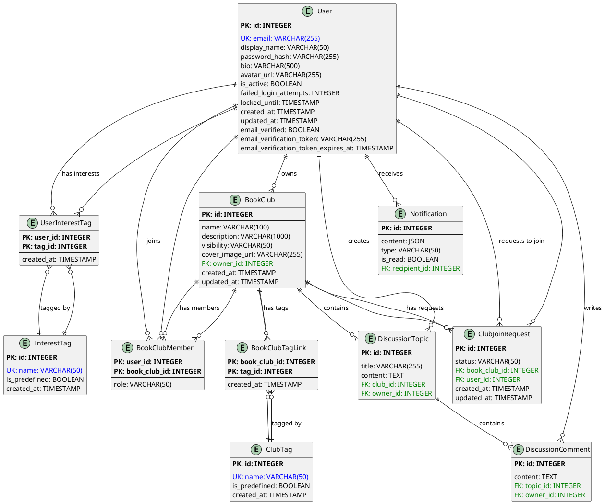

# Database Schema Documentation

**版本**: 1.1  
**最後更新**: 2025-10-30  
**擁有者**: Architect Winston, Dev James  
**狀態**: ✅ 已完成 (Story 3.2)  
**Current Schema Version**: d4c044f9fbde

---

## 📋 概述

此文件記錄線上讀書會平台的完整資料庫結構，包含所有 SQLModel Models、欄位定義、關聯關係和 ERD 圖表。此文件反映 Epic 3 完成後的資料庫狀態。

**技術棧**:
- **ORM**: SQLModel (FastAPI 整合)
- **Database**: PostgreSQL 15
- **Migration Tool**: Alembic
- **Naming Convention**: snake_case

---

## 📊 Entity Relationship Diagram (ERD)

---

## 🗃️ Tables and Models

### 1. User (用戶表)

**Table Name**: `user`  
**Description**: 儲存平台用戶的核心資訊，包含傳統 Email/密碼認證和 OAuth 認證。

| Column Name | Type | Constraints | Default | Description |
|---|---|---|---|---|
| `id` | INTEGER | PRIMARY KEY | AUTO | 用戶唯一識別碼 |
| `email` | VARCHAR(255) | UNIQUE, NOT NULL, INDEX | - | 用戶 Email 地址 |
| `display_name` | VARCHAR(50) | NOT NULL | - | 顯示名稱 |
| `password_hash` | VARCHAR(255) | NULLABLE | NULL | bcrypt 雜湊後的密碼 |
| `bio` | VARCHAR(500) | NULLABLE | NULL | 個人簡介 |
| `avatar_url` | VARCHAR(255) | NULLABLE | NULL | 頭像圖片 URL |
| `is_active` | BOOLEAN | NOT NULL | TRUE | 帳號是否啟用 |
| `failed_login_attempts` | INTEGER | NOT NULL | 0 | 登入失敗次數 |
| `locked_until` | TIMESTAMP | NULLABLE | NULL | 帳號鎖定至此時間 |
| `created_at` | TIMESTAMP | NOT NULL | CURRENT_TIMESTAMP | 建立時間 |
| `updated_at` | TIMESTAMP | NOT NULL | CURRENT_TIMESTAMP | 最後更新時間 |
| `email_verified` | BOOLEAN | NOT NULL | FALSE | Email 是否已驗證 |
| `email_verification_token` | VARCHAR(255) | NULLABLE, INDEX | NULL | Email 驗證 token |
| `email_verification_token_expires_at` | TIMESTAMP | NULLABLE | NULL | Email 驗證 token 過期時間 |

**Relationships**:
- `owned_clubs`: One-to-Many → BookClub (owner_id)
- `memberships`: One-to-Many → BookClubMember (user_id)
- `threads`: One-to-Many → DiscussionTopic (owner_id)
- `posts`: One-to-Many → DiscussionComment (owner_id)
- `notifications`: One-to-Many → Notification (recipient_id)
- `interest_tags`: Many-to-Many → InterestTag (via UserInterestTag)
- `join_requests`: One-to-Many → ClubJoinRequest (user_id)

### 2. InterestTag (興趣標籤表)

**Table Name**: `interesttag`  
**Description**: 儲存用戶興趣標籤，包含系統預定義和用戶自定義標籤。

| Column Name | Type | Constraints | Default | Description |
|---|---|---|---|---|
| `id` | INTEGER | PRIMARY KEY | AUTO | 標籤唯一識別碼 |
| `name` | VARCHAR(50) | UNIQUE, NOT NULL, INDEX | - | 標籤名稱 |
| `is_predefined` | BOOLEAN | NOT NULL | FALSE | 是否為系統預定義標籤 |
| `created_at` | TIMESTAMP | NOT NULL | CURRENT_TIMESTAMP | 建立時間 |

**Relationships**:
- `users`: Many-to-Many → User (via UserInterestTag)

### 3. UserInterestTag (用戶興趣標籤關聯表)

**Table Name**: `userinteresttag`  
**Description**: Many-to-Many 關聯表，連接 User 和 InterestTag。

| Column Name | Type | Constraints | Default | Description |
|---|---|---|---|---|
| `user_id` | INTEGER | PRIMARY KEY, FOREIGN KEY | - | 用戶 ID |
| `tag_id` | INTEGER | PRIMARY KEY, FOREIGN KEY | - | 標籤 ID |
| `created_at` | TIMESTAMP | NOT NULL | CURRENT_TIMESTAMP | 關聯建立時間 |

### 4. BookClub (讀書會表)

**Table Name**: `bookclub`  
**Description**: 儲存讀書會基本資訊。

| Column Name | Type | Constraints | Default | Description |
|---|---|---|---|---|
| `id` | INTEGER | PRIMARY KEY | AUTO | 讀書會唯一識別碼 |
| `name` | VARCHAR(100) | NOT NULL, INDEX | - | 讀書會名稱 |
| `description` | VARCHAR(1000) | NULLABLE | NULL | 讀書會簡介 |
| `visibility` | VARCHAR(50) | NOT NULL | 'public' | 可見性（public/private） |
| `cover_image_url` | VARCHAR(255) | NULLABLE | NULL | 封面圖片 URL |
| `owner_id` | INTEGER | FOREIGN KEY, NOT NULL | - | 擁有者用戶 ID |
| `created_at` | TIMESTAMP | NOT NULL | CURRENT_TIMESTAMP | 建立時間 |
| `updated_at` | TIMESTAMP | NOT NULL | CURRENT_TIMESTAMP | 最後更新時間 |

**Relationships**:
- `owner`: Many-to-One → User
- `members`: One-to-Many → BookClubMember
- `threads`: One-to-Many → DiscussionTopic
- `tags`: Many-to-Many → ClubTag (via BookClubTagLink)
- `join_requests`: One-to-Many → ClubJoinRequest

### 5. ClubTag (讀書會標籤表)

**Table Name**: `clubtag`  
**Description**: 儲存讀書會的分類標籤。

| Column Name | Type | Constraints | Default | Description |
|---|---|---|---|---|
| `id` | INTEGER | PRIMARY KEY | AUTO | 標籤唯一識別碼 |
| `name` | VARCHAR(50) | UNIQUE, NOT NULL, INDEX | - | 標籤名稱 |
| `is_predefined` | BOOLEAN | NOT NULL | FALSE | 是否為系統預定義標籤 |
| `created_at` | TIMESTAMP | NOT NULL | CURRENT_TIMESTAMP | 建立時間 |

**Relationships**:
- `book_clubs`: Many-to-Many → BookClub (via BookClubTagLink)

### 6. BookClubTagLink (讀書會標籤關聯表)

**Table Name**: `bookclubtaglink`  
**Description**: Many-to-Many 關聯表，連接 BookClub 和 ClubTag。

| Column Name | Type | Constraints | Default | Description |
|---|---|---|---|---|
| `book_club_id` | INTEGER | PRIMARY KEY, FOREIGN KEY | - | 讀書會 ID |
| `tag_id` | INTEGER | PRIMARY KEY, FOREIGN KEY | - | 標籤 ID |
| `created_at` | TIMESTAMP | NOT NULL | CURRENT_TIMESTAMP | 關聯建立時間 |

### 7. BookClubMember (讀書會成員關聯表)

**Table Name**: `bookclubmember`  
**Description**: 儲存讀書會成員關係和角色。

| Column Name | Type | Constraints | Default | Description |
|---|---|---|---|---|
| `user_id` | INTEGER | PRIMARY KEY, FOREIGN KEY | - | 用戶 ID |
| `book_club_id` | INTEGER | PRIMARY KEY, FOREIGN KEY | - | 讀書會 ID |
| `role` | VARCHAR(50) | NOT NULL | 'member' | 成員角色 |

**Relationships**:
- `user`: Many-to-One → User
- `book_club`: Many-to-One → BookClub

### 8. DiscussionTopic (討論主題表)

**Table Name**: `discussiontopic`  
**Description**: 儲存讀書會內的討論主題。

| Column Name | Type | Constraints | Default | Description |
|---|---|---|---|---|
| `id` | INTEGER | PRIMARY KEY | AUTO | 討論主題唯一識別碼 |
| `title` | VARCHAR(255) | NOT NULL | - | 討論標題 |
| `content` | TEXT | NOT NULL | - | 討論內容 |
| `club_id` | INTEGER | FOREIGN KEY, NOT NULL | - | 所屬讀書會 ID |
| `owner_id` | INTEGER | FOREIGN KEY, NOT NULL | - | 作者用戶 ID |

**Relationships**:
- `book_club`: Many-to-One → BookClub
- `author`: Many-to-One → User
- `comments`: One-to-Many → DiscussionComment

### 9. DiscussionComment (討論回覆表)

**Table Name**: `discussioncomment`  
**Description**: 儲存討論主題的回覆內容。

| Column Name | Type | Constraints | Default | Description |
|---|---|---|---|---|
| `id` | INTEGER | PRIMARY KEY | AUTO | 回覆唯一識別碼 |
| `content` | TEXT | NOT NULL | - | 回覆內容 |
| `topic_id` | INTEGER | FOREIGN KEY, NOT NULL | - | 所屬討論主題 ID |
| `owner_id` | INTEGER | FOREIGN KEY, NOT NULL | - | 作者用戶 ID |

**Relationships**:
- `topic`: Many-to-One → DiscussionTopic
- `author`: Many-to-One → User

### 10. Notification (通知表)

**Table Name**: `notification`  
**Description**: 儲存用戶通知。

| Column Name | Type | Constraints | Default | Description |
|---|---|---|---|---|
| `id` | INTEGER | PRIMARY KEY | AUTO | 通知唯一識別碼 |
| `content` | JSON | NOT NULL | - | 通知內容（JSON 格式） |
| `type` | VARCHAR(50) | NOT NULL | - | 通知類型 |
| `is_read` | BOOLEAN | NOT NULL | FALSE | 是否已讀 |
| `recipient_id` | INTEGER | FOREIGN KEY, NOT NULL | - | 接收者用戶 ID |

**Relationships**:
- `recipient`: Many-to-One → User

### 11. ClubJoinRequest (加入讀書會請求表)

**Table Name**: `clubjoinrequest`  
**Description**: 儲存用戶加入私密讀書會的請求。

| Column Name | Type | Constraints | Default | Description |
|---|---|---|---|---|
| `id` | INTEGER | PRIMARY KEY | AUTO | 請求唯一識別碼 |
| `status` | VARCHAR(50) | NOT NULL | 'pending' | 請求狀態 (pending, approved, rejected) |
| `book_club_id` | INTEGER | FOREIGN KEY, NOT NULL | - | 請求加入的讀書會 ID |
| `user_id` | INTEGER | FOREIGN KEY, NOT NULL | - | 請求發起人 ID |
| `created_at` | TIMESTAMP | NOT NULL | CURRENT_TIMESTAMP | 建立時間 |
| `updated_at` | TIMESTAMP | NOT NULL | CURRENT_TIMESTAMP | 最後更新時間 |

**Relationships**:
- `book_club`: Many-to-One → BookClub
- `user`: Many-to-One → User

---

## 🔄 Alembic Migration History

| Migration ID | Description | Date | Status |
|---|---|---|---|
| `ee6dbb92555d` | Create initial tables | 2025-10-15 | ✅ Applied |
| `7c65718e9851` | Add login protection fields to User | 2025-10-15 | ✅ Applied |
| `feb7a31e9ed1` | Add OAuth support to User model | 2025-10-16 | ✅ Applied |
| `26ef4d388ddb` | Add interest tags support | 2025-10-19 | ✅ Applied |
| `c0ad6aeb438a` | Add user timestamps | 2025-10-22 | ✅ Applied |
| `8dc583baeb87` | Add email verification fields | 2025-10-23 | ✅ Applied |
| `96905e63a696` | Add club tags and cover image | 2025-10-24 | ✅ Applied |
| `c50ef87cb809` | Add club join request table | 2025-10-25 | ✅ Applied |
| `d4c044f9fbde` | Add discussion topic and comment models | 2025-10-30 | ✅ Applied |

**Current Schema Version**: `d4c044f9fbde`